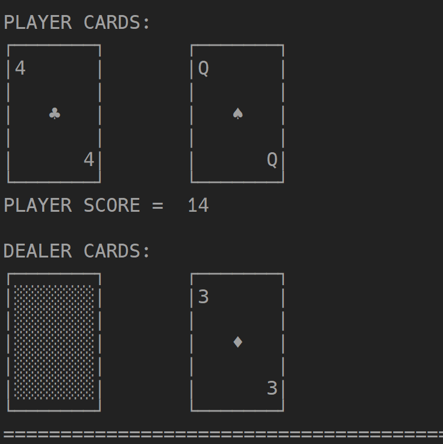
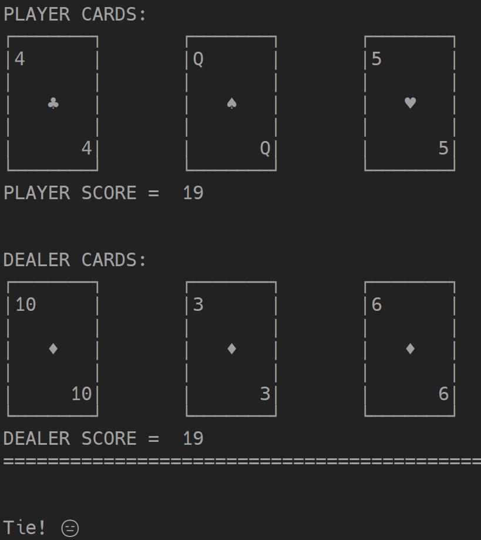

Python 学习  
          
# 资源  
> [官方文档](https://docs.python.org/3/tutorial/appetite.html)  
> [Python-100-Days](https://github.com/jackfrued/Python-100-Days/tree/master)  
> [廖雪峰Python教程](https://www.liaoxuefeng.com/wiki/1016959663602400/1016959856222624)  
> [Learn Python Programming](https://www.tutorialsteacher.com/python)  
> [python course](https://python-course.eu/)  
> [Python Tutorial](https://www.pythontutorial.net/)  
> Python 代码可视化生成器：[Python Tutor](https://pythontutor.com/visualize.html#mode=edit)  
> 查询特殊符号的unicode代码[unicode](https://home.unicode.org/)  
> 边框符号的unicode码[Box Drawing](https://unicode.org/charts/nameslist/n_2500.html)  
          
# 安装  
> 文档：[第01课：初识Python](https://github.com/jackfrued/Python-Core-50-Courses/blob/master/第01课：初识Python.md)  
> 视频：[Python零基础教程快速上手_全程干货+实用技巧小白必看](https://www.bilibili.com/video/BV1FT4y1R7sz/?p=3&spm_id_from=pageDriver&vd_source=a99dfd145a3e6aa8000930c149d4bf58)  
          
## Windows 安装  
          
### 安装 python 解释器  
官网下载安装包，跟着视频安装  
          
### VSCode 配置 python  
> [Python VScode 配置](https://www.runoob.com/python3/python-vscode-setup.html)  
          
vscode 中安装插件 python  
          
### PyCharm 安装配置  
> [配置 PyCharm 设置](https://www.pycharm.net.cn/configuring-project-and-ide-settings.html)  
          
Python IDE  
          
#### 配置 vim 编辑器  
> [在 PyCharm 中使用 Vim 编辑器 (IdeaVim)](https://www.pycharm.net.cn/using-product-as-the-vim-editor.html)  
> [ideavim](https://github.com/JetBrains/ideavim?tab=readme-ov-file)  
          
如果使用自定义 vimrc 配置文件，默认路径在 `~/.ideavimrc`，家目录的位置可以在 pycharm 终端通过 `echo $HOME` 获取，如 `C:\Users\lx`  
          
#### 修改下载镜像源  
打开终端，设置 pip 安装软件的镜像源  
```bash  
pip config set global.index-url https://pypi.doubanio.com/simple  
```  
          
#### 快捷键配置  
> [配置键盘快捷键](https://www.pycharm.net.cn/configuring-keyboard-and-mouse-shortcuts.html)  
          
||||  
|:--:|:--:|:--:|  
|设置|Ctrl+Alt+S||  
|执行选择的行|Shift+E|自定义|  
|显示运行窗口|Alt+4||  
|运行选择的行|Alt+E|自定义|  
|代码格式化|Ctrl+Alt+L||  
|文件格式化|Ctrl+Alt+Shift+L||  
|搜索函数|Ctrl+F12||  
|surround code|Ctrl+Alt+T||  
|unwrap|Ctrl+Shift+Delete||  
|collapse code|Ctrl -||  
|collapse all code|ctrl Shift -||  
|expand code|ctrl =||  
|expand all code|ctrl Shift =||  
  
          
          
#### 安装 IPython  
IPython（即交互式 Python）是一个用于 Python 的交互式命令行界面，它相比标准的 Python shell 提供了增强的功能和特性。  
          
```bash  
pip install ipython  
```  
          
终端输入 `ipython` 进入该交互式环境  
          
# 代码规范  
> [4.9. Intermezzo: Coding Style](https://docs.python.org/3/tutorial/controlflow.html#intermezzo-coding-style)  
          
# 基本语法规则  
> [2. Lexical analysis](https://docs.python.org/3/reference/lexical_analysis.html#line-structure)  
          
## 书写多行  
> [2.1.5. Explicit line joining](https://docs.python.org/3/reference/lexical_analysis.html#explicit-line-joining)  
          
          
### 多行注释  
```python  
# comment  
          
"""  
comment line  
comment line  
"""  
```  
          
### 非字符串和注释多物理行合并为逻辑行  
```python  
# 以反斜杠（/）结尾  
          
if 1900 < year < 2100 and 1 <= month <= 12 \  
   and 1 <= day <= 31 and 0 <= hour < 24 \  
   and 0 <= minute < 60 and 0 <= second < 60:   # Looks like a valid date  
        return 1  
```  
          
Expressions in parentheses, square brackets or curly braces can be split over more than one physical line without using backslashes.  
```python  
month_names = ['Januari', 'Februari', 'Maart',      # These are the  
               'April',   'Mei',      'Juni',       # Dutch names  
               'Juli',    'Augustus', 'September',  # for the months  
               'Oktober', 'November', 'December']   # of the year  
```  
          
### 多行字符串  
One way is using triple-quotes: """...""" or '''...'''. End of lines are automatically included in the string, but it’s possible to prevent this by adding a \ at the end of the line.  
          
```python  
print("""\  
Usage: thingy [OPTIONS]  
     -h                        Display this usage message  
     -H hostname               Hostname to connect to  
""")  
```  
          
每行末尾自动加上换行符，第一行加上 `\`可防止夹换行符  
          
如果书写时每行左侧有缩进，可以用  textwrap.dedent() 方法去掉每行开头的空格，见 [textwrap.dedent(text)](https://docs.python.org/3.12/library/textwrap.html#textwrap.dedent)  
          
# 数据类型和变量  
> [3. An Informal Introduction to Python](https://docs.python.org/3/tutorial/introduction.html)  
> [数据类型和变量](https://www.liaoxuefeng.com/wiki/1016959663602400/1017063826246112)  
> [第03课：Python语言元素之变量](https://github.com/jackfrued/Python-Core-50-Courses/blob/master/第03课：Python语言元素之变量.md)  
> [Built-in Types](https://docs.python.org/3/library/stdtypes.html#)  
> [字符串和编码](https://www.liaoxuefeng.com/wiki/1016959663602400/1017075323632896)  
          
          
## 字符串  
          
### f-string  
> [f-string](https://docs.python.org/3/reference/lexical_analysis.html#f-strings)  
          
### str.format 字符串格式化  
> [7.1.2. The String format() Method](https://docs.python.org/3/tutorial/inputoutput.html#the-string-format-method)  
> [Python format 格式化函数](https://www.runoob.com/python/att-string-format.html)  
          
```python  
print('We are the {} who say "{}!"'.format('knights', 'Ni'))  
# We are the knights who say "Ni!"  
          
print('{0} and {1}'.format('spam', 'eggs'))  
# spam and eggs  
          
print('{1} and {0}'.format('spam', 'eggs'))  
# eggs and spam  
          
print('This {food} is {adjective}.'.format(  
      food='spam', adjective='absolutely horrible'))  
# This spam is absolutely horrible.  
```  
```python  
def __str__(self):  
    """  
    :lines: 第一个参数为数字，占两位，左对齐，除了 10 其他只占用一个字符宽度  
    :lines: 第二个参数为数字，占一位，花色图案  
    :lines: 第三个参数为数字，占两位，右对齐，除了 10 其他只占用一个字符宽度  
    """  
    lines = """\  
    ┌───────┐  
    |{}     |  
    |       |  
    |   {}  |  
    |       |  
    |     {}|  
    └───────┘  
    """.format('{rank: <2}', '{suit_value: <2}', '{rank: >2}')  
          
    # 另一种方式，书写不美观，且麻烦  
    # lines = [[] for i in range(7)]  
    # space = '' if self.rank == '10' else ' '  
    # lines[0].append('┌───────┐')  
    # lines[1].append('|{}{}     |'.format(self.rank, space))  
    # lines[2].append('|       |')  
    # lines[3].append('|   {}   |'.format(self.suit_value))  
    # lines[4].append('|       |')  
    # lines[5].append('|     {}{}|'.format(space, self.rank))  
    # lines[6].append('└───────┘')  
    # result = [''.join(line) for line in lines]  
    # return '\n'.join(result)  
              
    return textwrap.dedent(lines.format(rank=self.rank, suit_value=self.suit_value))  
```  
          
          
### str.join 字符串连接  
> [Python String join() Method](https://www.w3schools.com/python/ref_string_join.asp)  
          
          
### str.split 分割字符串  
> [str.split(sep=None, maxsplit=- 1)](https://docs.python.org/3/library/stdtypes.html?highlight=splitlines#str.split)  
          
          
### str.splitlines 划分多行  
> [str.splitlines](https://docs.python.org/3/library/stdtypes.html?highlight=splitlines#str.splitlines)  
          
```python  
string1 = "Hello\nWorld\n"  
lines1 = string1.splitlines()  
print(lines1)  
# 输出：['Hello', 'World']  
```  
          
### str.strip 移除字符串首部和尾部的字符  
> [str.strip([chars])](https://docs.python.org/3.12/library/stdtypes.html#str.strip)  
      
      
不指定字符则默认移除 whitespace，只能移除开头和结尾的字符，中间的不移除  
```python  
>>> '   spacious   '.strip()  
'spacious'  
>>> '   spacious     hello  '.strip()  
'spacious     hello'  
>>> '   www.example.com   '.strip('wcom')  
'   www.example.com   '  
```  
      
### str.rstrip 移除字符串尾部字符  
      
### str.lstrip 移除字符串首部字符  
      
### str.title 返回标题话的字符串  
每个单词的首字母变大写，其余字母小写  
      
```python  
>>> '~HEllO WORld++'.title()  
'~Hello World++'  
```  
      
### str.count 统计字符出现次数  
```python  
message = "Hello, how are you today?"  
count_e = message.count("e")  
print(count_e)  # 输出: 2  
```  
### repr(str) 显示换行符等不可见字符  
```python  
>>> a = 'hello\t\tworld'  
>>> print(a)  
hello           world  
>>> print(repr(a))  
'hello\t\tworld'  
>>> print(str(a))  
hello           world  
```  
      
### 模板字符串 Template strings  
> [Template strings](https://docs.python.org/3.12/library/string.html#template-strings)  
      
      
```python  
>>> from string import Template  
>>> s = Template('$who likes $what')  
>>> s.substitute(who='tim', what='kung pao')  
'tim likes kung pao'  
>>> type(s)  
<class 'string.Template'>  
```  
和 shell 中使用变量相似，变量可用 ${} 包围  
```python  
>>> s1 = Template("${name}'s  $what")  
>>> str1 = s1.substitute(name='tim', what='cat')  
>>> str1  
"tim's  cat"  
```  
      
### raw string 原始字符串  
> [2.4.1. String and Bytes literals](https://docs.python.org/3/reference/lexical_analysis.html#string-and-bytes-literals)  
      
Both string and bytes literals may optionally be prefixed with a letter 'r' or 'R'; such strings are called raw strings and treat backslashes as literal characters.  
      
      
字符串前面加上r表示原始字符串（raw string），这意味着字符串中的转义字符将被视为普通字符，而不会被解释为特殊字符。这在处理正则表达式、文件路径等需要保留反斜杠的情况下非常有用。  
      
```python  
# 不使用原始字符串  
string1 = "C:\path\to\file.txt"  
print(string1)  # 输出：C:\path	o\file.txt  
      
# 使用原始字符串  
string2 = r"C:\path\to\file.txt"  
print(string2)  # 输出：C:\path\to\file.txt  
```  
      
```python  
import re  
      
# 使用原始字符串r"\d+"，我们不需要对正则表达式中的反斜杠进行双重转义，因为原始字符串会将其视为普通字符。  
pattern = r"\d+"  
string = "12345"  
      
result = re.findall(pattern, string)  
print(result)  # 输出：['12345']  
```  
      
## list 列表  
          
### list.extend 扩展列表  
> [Python List extend()方法](https://www.runoob.com/python/att-list-extend.html)  
          
将一个可迭代对象（如列表、元组、集合等）中的元素逐个添加到列表中  
```python  
list1 = [1, 2, 3]  
list2 = [4, 5, 6]  
          
list1.extend(list2)  
          
print(list1) # [1, 2, 3, 4, 5, 6]  
```  
          
### list.pop 移除列表指定位置元素  
          
```python  
fruits = ['apple', 'banana', 'orange']  
          
# 移除并返回最后一个元素  
last_fruit = fruits.pop()  
print(last_fruit)  # 输出: 'orange'  
print(fruits)      # 输出: ['apple', 'banana']  
          
# 移除并返回指定位置的元素  
second_fruit = fruits.pop(1)  
print(second_fruit)  # 输出: 'banana'  
print(fruits)        # 输出: ['apple']  
```  
        
## 二进制数据类型 Bytes  
> [Bytes Object](https://docs.python.org/3/library/stdtypes.html#binary-sequence-types-bytes-bytearray-memoryview)  
          
        
```python  
>>> s2 = 'hello world'  
>>> s3 = s2.encode()  
>>> type(s3)  
<class 'bytes'>  
>>> print(s3)  
b'hello world'  
```  
        
```python  
>>> import base64  
>>> s = b'hello world'  
>>> type(s)  
<class 'bytes'>  
>>> print(s)  
b'hello world'  
>>> base64.b64encode(s)  
b'aGVsbG8gd29ybGQ='  
```  
        
## 浅拷贝和深拷贝  
> [11. Shallow and Deep Copy](https://python-course.eu/python-tutorial/shallow-and-deep-copy.php)  
> [可视化代码](https://pythontutor.com/render.html#mode=edit)  
> [copy — Shallow and deep copy operations](https://docs.python.org/3/library/copy.html?highlight=list%20copy)  
    
### 直接赋值  
```python  
>>> c1 = ['r', 'b']  
>>> c2 = c1  
>>> print(id(c1), id(c2))  
1999885099584 1999885099584  
```  
c1 和 c2 内存地址相同，两个变量引用相同列表对象，为浅拷贝  
    
修改其中一个变量，另一个同步变化  
```python  
>>> c2[1] = 'y'  
>>> print(id(c1), id(c2))  
1999885099584 1999885099584  
>>> print(c1, c2)  
['r', 'y'] ['r', 'y']  
```  
    
### list.copy 拷贝  
help() 查看帮助，为浅拷贝  
```python  
>>> help(list.copy)  
Help on method_descriptor:  
copy(self, /)  
    Return a shallow copy of the list.  
```  
    
用 copy 函数拷贝，初始两个变量值相同  
```python  
>>> person1 = ["Swen", ["Seestrasse", "Konstanz"]]  
>>> person2 = person1.copy()  
>>> id(person1), id(person2)  
(140274482675840, 140274482838336)  
>>> id(person1[0]), id(person2[0])  
(140274482684528, 140274482684528)  
>>> id(person1[1]), id(person2[1])  
(140274482838400, 140274482838400)  
```  
    
如果修改其中一个变量的值，变化的值会分配新的内存地址  
```python  
>>> person2[0] = "Sarah"  
>>> id(person1[0]), id(person2[0])  
(140274482684528, 140274484527344)  
>>> id(person1[1]), id(person2[1])  
(140274482838400, 140274482838400)  
```  
其余的相同的值共享一个内存地址  
    
问题，当修改列表中的第二个元素的值时，两个变量的值同步修改：  
```python  
>>> person1  
['Swen', ['Seestrasse', 'Konstanz']]  
>>>  
>>> person2  
['Sarah', ['Seestrasse', 'Konstanz']]  
>>>  
>>> person2[1][0] = "Bücklestraße"  
>>>  
>>> person1  
['Swen', ['Bücklestraße', 'Konstanz']]  
>>>  
>>> person2  
['Sarah', ['Bücklestraße', 'Konstanz']]  
```  
第二个元素引用相同的内存的地址  
    
    
### list.deepcopy  
无上面 list.copy 的问题  
    
```python  
>>> from copy import deepcopy  
>>> person1 = ["Swen", ["Seestrasse", "Konstanz"]]  
>>> person2 = deepcopy(person1)  
>>>  
>>> person2[0] = "Sarah"  
>>> person2[1][0] = "Bücklestraße"  
>>>  
>>> person1  
['Swen', ['Seestrasse', 'Konstanz']]  
>>>  
>>> person2  
['Sarah', ['Bücklestraße', 'Konstanz']]  
```  
    
## 列表合并为字典  
    
```python  
keys = ["name", "age", "city"]  
values = ["Alice", 25, "New York"]  
    
dictionary = dict(zip(keys, values))  
print(dictionary)  
    
# {'name': 'Alice', 'age': 25, 'city': 'New York'}  
```  
    
## dic 字典  
    
## set 集合  
> [13. Sets and Frozen Sets](https://python-course.eu/python-tutorial/sets-and-frozen-sets.php)  
    
- 集合中元素不能重复  
```python  
>>> c = set([1, 1, 2, 3, 4])  
{1, 2, 3, 4}  
```  
    
- 集合中的元素要是 hashable 对象，元素是不可变对象  
下面写法出错，不能以列表作为元素  
```python  
>>> cities = set((["Python","Perl"], ["Paris", "Berlin", "London"]))  
```  
    
能以元组作为元素  
```python  
>>> cities = set((("Python","Perl"), ("Paris", "Berlin", "London")))  
```  
    
- 集合中元素要为 immutable object，但集合本身是 mutable，可以添加和删除元素等  
    
```python  
fruits = {"apple", "banana"}  
fruits.update(["orange", "mango"])  
print(fruits)  # 输出: {'apple', 'banana', 'orange', 'mango'}  
```  
    
- frozenset 是 immutable  
    
- 注意集合赋值和 copy 的区别  
    
- 注意 remove 和 discard 的区别  
    
- 注意 add 和 update 区别  
    
    
    
    
# 切片  
> [切片](https://www.liaoxuefeng.com/wiki/1016959663602400/1017269965565856)  
          
```python  
a = "Hello, World!"  
print(a[2:5])  # llo  不包括右边界  
```  
          
- 列表切片  
```python  
my_list = [1, 2, 3, 4, 5, 6, 7, 8, 9, 10]  
# 获取索引2到索引5之间的元素（不包括索引5）  
sliced_list = my_list[2:5]  
print(sliced_list)  # 输出: [3, 4, 5]  
          
# 获取从列表末尾开始的倒数两个元素 -1 为倒数第一个元素  
sliced_list = my_list[-2:]  
print(sliced_list)  # 输出: [9, 10]  
          
# 使用步长获取列表中的每第二个元素  
sliced_list = my_list[::2]  
print(sliced_list)  # 输出: [1, 3, 5, 7, 9]  
           
# 获取第一个元素到倒数第二元素  
my_list = [1, 2, 3, 4, 5]  
sliced_list = my_list[:-1]  
print(sliced_list)  # 输出: [1, 2, 3, 4]  
```  
          
- 字符串切片  
```python  
my_string = "Hello, World!"  
          
# 使用负数索引获取字符串末尾的字符  
sliced_string = my_string[-6:-1]  
print(sliced_string)  # 输出: "World"  
```  
          
- 元组切片  
```python  
my_tuple = (1, 2, 3, 4, 5)  
# 获取从索引1到索引4之间的元素（不包括索引4）  
sliced_tuple = my_tuple[1:4]  
print(sliced_tuple)  # 输出: (2, 3, 4)  
```  
          
          
# 列表生成式  
> [列表生成式](https://www.liaoxuefeng.com/wiki/1016959663602400/1017317609699776)  
          
```python  
# 生成一个由两个元素的元组组成的列表  
pairs = [(x, y) for x in [1, 2, 3] for y in [4, 5, 6]]  
print(pairs)  # 输出: [(1, 4), (1, 5), (1, 6), (2, 4), (2, 5), (2, 6), (3, 4), (3, 5), (3, 6)]  
          
# 生成一个由偶数构成的列表  
numbers = [x for x in range(10) if x % 2 == 0]  
print(numbers)  # 输出: [0, 2, 4, 6, 8]  
          
# 生成一个由两个字符串的组合构成的列表  
words = ['Hello', 'World', 'Python']  
combined = [x + ' ' + y for x in words for y in words if x != y]  
# 输出: ['Hello World', 'Hello Python', 'World Hello', 'World Python', 'Python Hello', 'Python World']  
print(combined)  
```  
          
```python  
result = []  
for index, line in enumerate(lines):  
    result.append(''.join(lines[index]))  
          
# 上面三行代码用下面一行代替  
result = [''.join(line) for line in lines]  
```  
          
          
```python  
def deal(self, number):  
    cards_dealt = []  
    for _ in range(number):  
        if len(self.cards) > 0:  
            card = self.cards.pop()  
            cards_dealt.append(card)  
    return cards_dealt  
          
    # 简化上面的代码为一行  
    return [self.cards.pop() for _ in range(number) if self.cards]  
```  
          
          
# 表达式  
> [6. Expressions](https://docs.python.org/3/reference/expressions.html)  
          
          
## 条件表达式 conditional expression  
> [6.13. Conditional expressions](https://docs.python.org/3/reference/expressions.html#conditional-expressions)  
> [Conditional Statements in Python](https://realpython.com/python-conditional-statements/)  
          
```python  
a = 2  
b = 2  
          
if b < 5:  
    a = a + 1  
else:  
    a = 0  
          
# 等价于  
a = a + 1 if b < 5 else 0  
print (a) # 0  
```  
          
```python  
a = 2  
b = 2  
          
if b < 5:  
    a = a + 1  
          
# 等价于  
a += 1 if b < 5 else 0  
print (a) # 2  
```  
# 操作符  
          
## * 操作符  
          
### 解包操作 unpacking  
```python  
numbers = [1, 2, 3, 4, 5]  
a, *b, c = numbers  
          
print(a)  # 输出: 1  
print(b)  # 输出: [2, 3, 4]  
print(c)  # 输出: 5  
```  
          
```python  
list1 = [1, 2, 3]  
list2 = ['a', 'b', 'c']  
list3 = [True, False, True]  
          
lists = [list1, list2, list3]  
          
zipped = zip(*lists)  
          
for item in zipped:  
    print(item)  
          
"""  
(1, 'a', True)  
(2, 'b', False)  
(3, 'c', True)  
"""  
```  
          
### 可变参数  
```python  
def print_arguments(*args):  
    for arg in args:  
        print(arg)  
          
print_arguments(1, 2, 3)  # 输出: 1 2 3  
          
# 在函数定义中，`*args`将多个参数打包成一个元组 `args`。  
# 在函数调用时，`*numbers`将元组 `numbers` 解包为多个参数传递给函数。  
numbers = (4, 5, 6)  
print_arguments(*numbers)  # 输出: 4 5 6  
```  
          
```python  
def concatenate(*args):  
    return ''.join(args)  
          
result = concatenate('Hello', ' ', 'World')  
print(result)  # 输出: Hello World  
```  
          
          
### 重复 repetition  
> [The Pitfalls of Repetitions](https://python-course.eu/python-tutorial/sequential-data-types.php)  
    
    
注意重复操作时的一些陷阱  
```python  
nested_list = [[0] * 3] * 4  
print(nested_list)  
# 输出: [[0, 0, 0], [0, 0, 0], [0, 0, 0], [0, 0, 0]]  
    
nested_list[0][0] = 1  
print(nested_list)  
# 输出: [[1, 0, 0], [1, 0, 0], [1, 0, 0], [1, 0, 0]]  
```  
可通过 [可视化代码](https://pythontutor.com/render.html#mode=edit) 查看原理  
    
    
    
    
    
    
# 循环和分支结构  
> [第05课：分支结构](https://github.com/jackfrued/Python-Core-50-Courses/blob/master/第05课：分支结构.md)  
> [条件判断](https://www.liaoxuefeng.com/wiki/1016959663602400/1017099478626848)  
          
          
## for 循环  
          
### 从列表第二个元素开始循环  
          
- 利用 range  
```python  
my_list = [1, 2, 3, 4, 5]  
          
# 获取列表的元素个数  
length = len(my_list)  
          
# 从第二个元素开始循环  
for i in range(1, length):  
    print(my_list[i])  
```  
          
- 利用切片  
```python  
my_list = [1, 2, 3, 4, 5]  
          
# 获取从第二个元素开始的子列表  
sub_list = my_list[1:]  
          
# 循环遍历子列表  
for element in sub_list:  
    print(element)  
```  
          
```python  
my_list = [1, 2, 3, 4, 5]  
          
# 循环遍历列表，跳过第一个元素  
for i, element in enumerate(my_list[1:]):  
    print(i, element)  
```  
          
### for else  
```python  
numbers = [1, 2, 3, 4, 5]  
  
for num in numbers:  
    if num == 0:  
        print("Zero found, breaking the loop.")  
        break  
    print(num)  
else:  
    # 循环正常结束，则执行 else 语句块  
    print("Loop completed without encountering zero.")  
```  
## while 循环  
  
### while else  
```python  
while True:  
    print("You are in a infinite loop")  
    if num == 0:  
        print("Zero found, breaking the loop.")  
        break  
    print(num)  
else:  
    # 循环正常结束，未被 break 提前终止，则执行 else 语句块  
    print("Loop completed without encountering zero.")  
```  
# 模式匹配 match case  
> [17. Structural Pattern Matching](https://python-course.eu/python-tutorial/structural-pattern-matching.php)  
    
    
```python  
command = input("What are you doing next? ")  
match command.split():  
    case ["go", ("north" | "south" | "east" | "west") as direction]:  
        print(f"You go {direction}")  
```  
    
```python  
command = input("What are you doing next? ")  
possible_direction = ['north', 'south']  
match command.split():  
    case ["go", direction] if direction in possible_direction:  
        print(f"So, let's go {direction}!")  
```  
    
# 输入和输出  
    
## 输入 input  
- 区别 eval(input()) 和 input()  
    
    
## 输出 print  
> [22. Formatted Output](https://python-course.eu/python-tutorial/formatted-output.php)  
    
    
    
    
# Python Scopes and Namespaces  
> [9.2. Python Scopes and Namespaces](https://docs.python.org/3/tutorial/classes.html#python-scopes-and-namespaces)  
> [Python零基础教程快速上手_全程干货+实用技巧小白必看](https://www.bilibili.com/video/BV1FT4y1R7sz?p=79&vd_source=a99dfd145a3e6aa8000930c149d4bf58)  
> [27. Namespaces](https://python-course.eu/python-tutorial/namespaces.php)  
    
          
1. 作用域规则：  
   - 局部作用域（Local Scope）：在函数内部定义的变量具有局部作用域，只能在函数内部访问。  
   - 嵌套作用域（Enclosing Scope）：当函数嵌套在另一个函数内部时，内部函数可以访问外部函数的变量。外部函数的作用域称为嵌套作用域。  
   - 全局作用域（Global Scope）：在模块级别定义的变量具有全局作用域，可以在模块中的任何地方访问。  
   - 内置作用域（Built-in Scope）：Python中有一些内置的名称，例如`print()`和`len()`。这些名称属于内置作用域，可以在任何地方直接访问。  
          
2. LEGB规则：Python中的名称解析遵循LEGB规则，即按照以下顺序查找名称：  
   - Local（局部）：在当前作用域内查找变量名。  
   - Enclosing（嵌套）：在嵌套作用域中查找变量名，逐级向外查找。  
   - Global（全局）：在全局作用域中查找变量名。  
   - Built-in（内置）：在内置作用域中查找变量名。  
          
   根据LEGB规则，Python会按照从内到外的顺序查找变量名，直到找到第一个匹配的名称。如果没有找到匹配的名称，将引发`NameError`异常。  
          
3. global和nonlocal关键字：  
   - `global`关键字：当在函数内部修改全局变量时，需要使用`global`关键字声明变量为全局变量，以便在函数内部进行修改。  
   - `nonlocal`关键字：当在嵌套函数内部修改嵌套作用域的变量时，需要使用`nonlocal`关键字声明变量为非局部变量。  
          
4. 静态名称解析：  
   在Python 3中，引入了类型提示和静态类型检查工具，例如mypy。这些工具可以在编译时对代码进行静态类型检查，提供更早的错误检测和自动补全。静态类型检查可以在一定程度上改变名称解析的行为，使其更静态化，并提供更准确的类型推断。  
          
Python中的作用域由文本结构确定，名称解析是在运行时动态进行的。LEGB规则指定了名称解析的优先级顺序。使用`global`和`nonlocal`关键字可以修改全局变量和嵌套作用域的变量。Python语言的演进将静态类型检查引入到编译阶段，提供了更准确的类型推断和错误检测。这些概念对于理解Python中的作用域和名称解析机制至关重要。  
          
# 函数  
> [第13课：函数和模块](https://github.com/jackfrued/Python-Core-50-Courses/blob/master/第13课：函数和模块.md)  
> [函数](https://www.liaoxuefeng.com/wiki/1016959663602400/1017105145133280)  
> [4.7. Defining Functions](https://docs.python.org/3/tutorial/controlflow.html#defining-functions)  
          
          
## 变量的作用域  
> [4.7. Defining Functions](https://docs.python.org/3/tutorial/controlflow.html#defining-functions)  
> [Python零基础教程快速上手_全程干货+实用技巧小白必看](https://www.bilibili.com/video/BV1FT4y1R7sz?p=71&vd_source=a99dfd145a3e6aa8000930c149d4bf58)  
          
          
The execution of a function introduces a new symbol table used for the local variables of the function. More precisely, all variable assignments in a function store the value in the local symbol table; whereas variable references first look in the local symbol table, then in the local symbol tables of enclosing functions, then in the global symbol table, and finally in the table of built-in names. Thus, global variables and variables of enclosing functions cannot be directly assigned a value within a function (unless, for global variables, named in a global statement, or, for variables of enclosing functions, named in a nonlocal statement), although they may be referenced.  
          
    
```python  
x = 10  # 全局变量  
    
def outer_function():  
    x = 20  # 外部函数的局部变量  
    
    def inner_function():  
        nonlocal x  
        x = 30  # 修改外部函数的变量  
        print("inner_function 中的 x:", x)  # 输出: 30  
    
    inner_function()  
    print("outer_function 中的 x:", x)  # 输出: 30  
    
def global_function():  
    global x  
    x = 40  # 修改全局变量的值  
    print("global_function 中的 x:", x)  # 输出: 40  
    
outer_function()  
print("全局作用域中的 x:", x)  # 输出: 40  
    
global_function()  
print("全局作用域中的 x:", x)  # 输出: 40  
```  
          
## 默认参数  
> [4.7. Defining Functions](https://docs.python.org/3/tutorial/controlflow.html#defining-functions)  
          
The default value is evaluated only once. This makes a difference when the default is a mutable object such as a list, dictionary, or instances of most classes. For example, the following function accumulates the arguments passed to it on subsequent calls:  
          
```python  
def f(a, L=[]):  
    L.append(a)  
    return L  
          
print(f(1))  
print(f(2))  
print(f(3))  
```  
          
output:  
```python  
[1]  
[1, 2]  
[1, 2, 3]  
```  
          
## 特殊参数  
> [Python零基础教程快速上手_全程干货+实用技巧小白必看](https://www.bilibili.com/video/BV1FT4y1R7sz?p=80&vd_source=a99dfd145a3e6aa8000930c149d4bf58)  
> [第15课：函数使用进阶](https://github.com/jackfrued/Python-Core-50-Courses/blob/master/第15课：函数使用进阶.md)  
> [4.8.2. Keyword Arguments](https://docs.python.org/3/tutorial/controlflow.html#keyword-arguments)  
> [26. Parameters And Arguments](https://python-course.eu/python-tutorial/parameters-and-arguments.php)  
          
By default, arguments may be passed to a Python function either by position or explicitly by keyword.  
          
### 位置参数 positional argument  
默认参数为位置参数，调用函数时直接传递参数值  
```python  
# 标准参数可以传递参数值或 arg=value 的形式  
def standard_arg(arg):  
    print(arg)  
          
def pos_only_arg(arg, /):  
    print(arg)  
          
def kwd_only_arg(*, arg):  
    print(arg)  
          
def combined_example(pos_only, /, standard, *, kwd_only):  
    print(pos_only, standard, kwd_only)  
```  
          
Parameters following the / may be positional-or-keyword or keyword-only.  
          
          
### 关键字参数 keyword argument  
函数调用时传递参数为 name=value 形式  
          
```python  
def kwd_only_arg(*, arg):  
    print(arg)  
          
kwd_only_arg(arg=3)  
```  
          
### 可变参数 *arg  
```python  
def write_multiple_items(file, separator, *args):  
    file.write(separator.join(args))  
```  
          
*arg 传递的参数只能是位置参数，传递的参数类型为 tuple  
上面例子中前面的两个参数为位置参数，不能传递 name=value 的形式  
          
*arg 后面的参数为关键字参数  
```python  
def concat(*args, sep="/"):  
    return sep.join(args)  
          
concat("earth", "mars", "venus")  
'earth/mars/venus'  
concat("earth", "mars", "venus", sep=".")  
'earth.mars.venus'  
```  
          
### 可变参数 **kwarg  
**kwarg 传递的可变参数类型为 dictionary，参数为关键字参数  
          
```python  
def cheeseshop(kind, *arguments, **keywords):  
    print("-- Do you have any", kind, "?")  
    print("-- I'm sorry, we're all out of", kind)  
    for arg in arguments:  
        print(arg)  
    print("-" * 40)  
    for kw in keywords:  
        print(kw, ":", keywords[kw])  
```  
          
通常 *arguments 放在 **keywards 前面  
          
## 返回值  
- 函数可以返回多个值  
```python  
def get_name_and_age():  
    name = "Alice"  
    age = 25  
    return name, age  
    
result = get_name_and_age()  
print(result)  # 输出: ('Alice', 25)  
    
name, age = get_name_and_age()  
print(name)  # 输出: Alice  
print(age)   # 输出: 25  
```  
    
```python  
def get_numbers():  
    numbers = [1, 2, 3, 4, 5]  
    evens = [n for n in numbers if n % 2 == 0]  
    odds = [n for n in numbers if n % 2 != 0]  
    return evens, odds  
    
result = get_numbers()  
print(result)  # 输出: ([2, 4], [1, 3, 5]) 元组类型  
    
evens, odds = get_numbers()  
print(evens)  # 输出: [2, 4]  
print(odds)   # 输出: [1, 3, 5]  
```  
    
    
    
## 类型提示 type hint  
> [typing — Support for type hints](https://docs.python.org/3/library/typing.html)  
> [How to Use Type Hints for Multiple Return Types in Python](https://realpython.com/python-type-hints-multiple-types/)  
> [全面理解Python中的类型提示（Type Hints）](https://sikasjc.github.io/2018/07/14/type-hint-in-python/)  
          
```python  
def greeting(name: str) -> str:  
    return 'Hello ' + name  
```  
          
## Lambda 表达式  
> [4.8.6. Lambda Expressions](https://docs.python.org/3/tutorial/controlflow.html#lambda-expressions)  
> [第15课：函数使用进阶](https://github.com/jackfrued/Python-Core-50-Courses/blob/master/第15课：函数使用进阶.md)  
          
## 文档字符串 Documentation String  
> [4.8.7. Documentation Strings](https://docs.python.org/3/tutorial/controlflow.html#documentation-strings)  
          
在Python中，每个函数都可以包含一个特殊的文档字符串（Documentation String），也被称为docstring。文档字符串是函数定义的一部分，用于提供对函数的说明、描述和文档。  
          
文档字符串通常位于代码单元的定义之后，使用三重引号（单引号或双引号）括起来，以便可以跨多行编写。  
          
通过访问函数的 __doc__ 属性，可以获取该函数的文档字符串。  
          
```python  
def my_function():  
    """Do nothing, but document it.  
          
    No, really, it doesn't do anything.  
    """  
    pass  
          
# 打印函数的文档字符串  
print(my_function.__doc__)  
```  
          
## 函数注释 Function Annotations  
> [4.8.8. Function Annotations](https://docs.python.org/3/tutorial/controlflow.html#function-annotations)  
          
Python函数注释（Function Annotations）是一种在函数定义中提供参数和返回值类型信息的方式。  
          
```python  
def add_numbers(a: int, b: int) -> int:  
    """Add two numbers and return the sum."""  
    return a + b  
              
# 显示函数注释信息  
print(add_numbers.__annotations__)  
```  
          
output:  
```python  
{'a': <class 'int'>, 'b': <class 'int'>, 'return': <class 'int'>}  
```  
          
## 高阶函数  
> [Python High Order Function](https://www.javatpoint.com/python-high-order-function)  
> [高阶函数](https://www.liaoxuefeng.com/wiki/1016959663602400/1017328655674400)  
          
          
## 装饰器  
> [第16课：函数的高级应用](https://github.com/jackfrued/Python-Core-50-Courses/blob/master/第16课：函数的高级应用.md)  
          
```python  
import time  
  
def timer_decorator(func):  
    def wrapper(*args, **kwargs):  
        start_time = time.time()  
        result = func(*args, **kwargs)  
        end_time = time.time()  
        execution_time = end_time - start_time  
        print(f"函数 {func.__name__} 执行时间为: {execution_time} 秒")  
        return result  
    return wrapper  
  
@timer_decorator  
def process_data(data):  
    # 模拟耗时操作  
    time.sleep(2)  
    print("数据处理完成")  
    return "处理结果"  
  
result = process_data("input_data")  
print(result)  
```  
定义了一个装饰器函数timer_decorator，它用于计算函数的执行时间。  
  
装饰器函数接受一个函数作为参数，并返回一个新的函数wrapper来替代原始的函数。wrapper函数接受任意数量的位置参数*args和关键字参数**kwargs，以适应不同函数的参数形式。  
  
通过将装饰器函数应用于目标函数，即@timer_decorator，我们对process_data函数进行装饰。每当调用process_data函数时，实际上是调用了装饰器函数返回的wrapper函数。  
  
***************************************  
  
```python  
def decorator(func):  
    print("装饰器函数内的代码执行1")  
  
    def wrapper(*args, **kwargs):  
        print("包裹函数内的代码执行")  
        return func(*args, **kwargs)  
  
    print("装饰器函数内的代码执行2")  
    return wrapper  
  
@decorator  
def target_function():  
    print("目标函数内的代码执行")  
  
target_function()  
print('+' * 20)  
target_function()  
```  
output:  
```python  
装饰器函数内的代码执行1  
装饰器函数内的代码执行2  
包裹函数内的代码执行  
目标函数内的代码执行  
++++++++++++++++++++  
包裹函数内的代码执行  
目标函数内的代码执行  
```  
当你多次调用target_function()时，"装饰器函数内的代码执行"只会执行一次。这是因为装饰器在应用时，会在定义被装饰的函数时执行，而不是在每次调用被装饰的函数时执行。  
  
装饰器的作用是将被装饰的函数替换为新的函数，以添加额外的功能或修改行为。一旦装饰器被应用，被装饰的函数就变成了新的函数，而装饰器函数内的代码只会在装饰器应用时执行一次。  
  
******************************  
  
装饰器函数应定义在类的外部  
```python  
# 定义在类外部  
def decorator(func):  
    def wrapper(*args, **kwargs):  
        print("装饰器函数内的代码执行")  
        return func(*args, **kwargs)  
    return wrapper  
  
class Example:  
    @decorator  
    def target_function(self):  
        print("目标函数内的代码执行")  
  
example = Example()  
example.target_function()  
```  
  
  
## 内置函数  
          
### Sequence Types — list, tuple, range  
> [Sequence Types — list, tuple, range](https://docs.python.org/3/library/stdtypes.html?highlight=range#sequence-types-list-tuple-range)  
> [Python3 enumerate() 函数](https://www.runoob.com/python3/python3-func-enumerate.html)  
          
### enumerate  
> [enumerate](https://docs.python.org/3/library/functions.html#enumerate)  
          
```python  
seq = ['one', 'two', 'three']  
          
for i, element in enumerate(seq):  
    print(i, element)  
```  
输出：  
```python  
0 one  
1 two  
2 three  
```  
          
### zip  
> [zip(*iterables, strict=False)](https://docs.python.org/3/library/functions.html?highlight=zip#zip)  
          
```python  
list1 = [1, 2, 3]  
list2 = ['a', 'b', 'c']  
list3 = [True, False, True]  
          
zipped = zip(list1, list2, list3)  
          
for item in zipped:  
    print(item)  
```  
          
输出：  
```python  
(1, 'a', True)  
(2, 'b', False)  
(3, 'c', True)  
```  
          
          
元素组合过程中定义分隔符：  
```python  
list1 = [1, 2, 3]  
list2 = ['a', 'b', 'c']  
list3 = [True, False, True]  
          
zipped = zip(list1, list2, list3)  
          
result_list = ['\t\t'.join(str(item) for item in items) for items in zipped]  
          
print(result_list) # ['1\t\ta\t\tTrue', '2\t\tb\t\tFalse', '3\t\tc\t\tTrue']  
```  
    
转置矩阵：  
```python  
matrix = [[1, 2, 3], [4, 5, 6], [7, 8, 9]]  
    
transposed = zip(*matrix)  
    
for row in transposed:  
    print(row)  
    
"""  
output:  
(1, 4, 7)  
(2, 5, 8)  
(3, 6, 9)  
"""  
```  
*matrix 将 matrix 解压为多个单独的参数，相当于将每个子列表提取出来：  
```python  
*matrix => [1, 2, 3], [4, 5, 6], [7, 8, 9]  
```  
    
zip() 函数将每个参数的对应位置进行配对，并返回一个元组的迭代器，其中每个元组包含来自输入参数的相应元素。  
    
          
### super  
> [Introduction to the Python super](https://www.pythontutorial.net/python-oop/python-super/)  
          
        
通过使用super()函数，我们可以在子类中方便地访问父类的属性和方法，并在需要的情况下进行重写或扩展  
```python  
class ParentClass:  
    def __init__(self):  
        self.value = 5  
        
    def some_method(self):  
        print("父类方法被调用")  
        
class ChildClass(ParentClass):  
    def __init__(self):  
        super().__init__()  # 调用父类的构造函数  
        self.child_value = 10  
        
    def some_method(self):  
        super().some_method()  # 调用父类的方法  
        print("子类方法被调用")  
        
# 创建子类对象  
child = ChildClass()  
        
# 调用子类方法  
child.some_method()  
        
        
# output  
# 父类方法被调用  
# 子类方法被调用  
```  
          
###  type 和 isinstance  
> [Difference between type and isinstance](https://python-course.eu/oop/inheritance.php)  
          
`isinstance` returns True if we compare an object either with the class it belongs to or with the superclass. Whereas the equality operator only returns True, if we compare an object with its own class.  
        
```python  
x = Robot("Marvin")  
y = PhysicianRobot("James")  
        
print(isinstance(x, Robot), isinstance(y, Robot)) # True True  
print(type(y) == Robot, type(y) == PhysicianRobot)  # False True  
```  
        
### id 获取内存地址  
```python  
c1 = ['r', 'b']  
c2 = c1  
print(id(c1), id(c2))  
1999885099584 1999885099584  
```  
    
### map   
`map` 是 Python 内置函数之一，它用于对可迭代对象的每个元素应用一个指定的函数，并返回一个包含结果的迭代器。  
  
```python  
# 定义一个函数，用于对输入值进行平方操作  
def square(x):  
    return x ** 2  
  
# 使用 map 函数对列表中的每个元素进行平方操作  
numbers = [1, 2, 3, 4, 5]  
squared_numbers = map(square, numbers)  
  
# 转换为列表并打印结果  
print(list(squared_numbers))  
```  
  
用 lambda 进行优化：  
```python  
# 定义一个列表  
numbers = [1, 2, 3, 4, 5]  
  
# 使用 map 和 lambda 对列表中的每个元素进行平方操作  
squared_numbers = map(lambda x: x ** 2, numbers)  
  
# 转换为列表并打印结果  
print(list(squared_numbers))  
```  
  
### filter  
`filter` 是 Python 内置函数之一，它用于过滤可迭代对象中的元素，只保留满足指定条件的元素。  
  
```python  
# 定义一个函数，用于检查一个数字是否为偶数  
# def is_even(num):  
    # return num % 2 == 0  
  
# 定义一个列表  
numbers = [1, 2, 3, 4, 5, 6, 7, 8, 9, 10]  
  
# 使用 filter 函数筛选出偶数  
even_numbers = filter(lambda x: x % 2 == 0, numbers)  
  
# 转换为列表并打印结果  
print(list(even_numbers))  
```  
1. **`filter` 函数的使用：**  
   - `filter(is_even, numbers)` 对列表 `numbers` 中的每个元素应用 `is_even` 函数。  
   - 返回的是一个迭代器，其中包含满足条件（`True`）的元素。  
  
2. **转换为列表并打印结果：**  
   - `list(even_numbers)` 将迭代器转换为列表。  
   - 打印结果为筛选出的偶数：`[2, 4, 6, 8, 10]`。  
  
使用 `filter` 函数的优势在于它提供了一种简单而强大的方式来从可迭代对象中筛选出符合条件的元素，而不需要显式编写循环。可以将任何返回 `True` 或 `False` 的可调用对象传递给 `filter` 函数，包括函数、lambda 表达式等。  
  
另外，和 `map` 类似，`filter` 函数返回的也是一个迭代器，具有惰性求值的特性。  
  
惰性求值（Lazy Evaluation）是一种计算模式，它表示在需要的时候才计算表达式的值，而不是立即计算。在编程语言中，这种方式可以带来一些优势，包括节省内存、提高性能，以及支持无限序列等。  
  
  
### reduce  
> [Reducing a List](https://python-course.eu/advanced-python/lambda-filter-reduce-map.php)  
  
`reduce` 是 Python 内置函数之一，它用于对可迭代对象中的元素进行累积操作，通过指定的函数将序列元素合并为单个值。  
  
```python  
from functools import reduce  
  
# 定义一个函数，用于计算累积乘积  
# def multiply(x, y):  
    # return x * y  
  
# 使用 reduce 函数计算累积乘积  
result = reduce(lambda x, y: x*y, range(1, 101))  
  
# 打印结果  
print(result) # 5050  
```  
  
`reduce` 函数从左到右依次将序列元素和累积结果传递给指定的函数。  
  
需要注意的是，使用 `reduce` 函数时，传入的函数必须接受两个参数，因为 `reduce` 在每一步都会取当前累积值和下一个元素作为参数调用指定的函数。  
  
`reduce` 对于一些需要迭代计算累积值的场景非常有用，例如计算阶乘、累积求和等。  
  
## 递归函数  
> [1. Recursive Functions](https://python-course.eu/advanced-python/recursive-functions.php)  
  
  
# 包 Packages  
> [6.4. Packages](https://docs.python.org/3/tutorial/modules.html#packages)  
> [Python零基础教程快速上手_全程干货+实用技巧小白必看](https://www.bilibili.com/video/BV1FT4y1R7sz?p=78&vd_source=a99dfd145a3e6aa8000930c149d4bf58)  
> [31. Packages](https://python-course.eu/python-tutorial/packages.php)  
          
          
Packages are a way of structuring Python’s module namespace by using “dotted module names”.  
          
    
在 Python 中，模块（Module）和包（Package）是组织和管理代码的两个重要概念。  
    
**模块（Module）**指的是一个包含 Python 代码的文件。一个模块可以包含函数、类、变量和可执行的代码，并提供一组相关的功能。模块的文件名通常以 `.py` 扩展名结尾。通过使用 `import` 语句，可以在其他 Python 脚本中引入模块，并使用模块中定义的函数、类和变量。  
    
例如，假设我们有一个名为 `math_utils.py` 的模块文件，其中定义了一些数学相关的函数：  
    
```python  
# math_utils.py  
    
def add(x, y):  
    return x + y  
    
def subtract(x, y):  
    return x - y  
```  
    
在另一个 Python 脚本中，我们可以通过 `import` 语句引入该模块，并使用其中定义的函数：  
    
```python  
import math_utils  
    
result = math_utils.add(3, 4)  
print(result)  # 输出: 7  
```  
    
**包（Package）**则是一种用于组织模块的目录结构。包是一个包含了多个模块的目录，它可以有多层嵌套的子目录。包的根目录通常包含一个特殊的文件 `__init__.py`，用于标识该目录是一个包。包可以让我们更好地组织和管理模块，并提供命名空间的支持。  
    
例如，我们可以创建一个名为 `my_package` 的包，其中包含了两个模块 `module1.py` 和 `module2.py`：  
    
```  
my_package/  
    __init__.py  
    module1.py  
    module2.py  
```  
    
在其他 Python 脚本中，可以使用 `import` 语句来引入包和其中的模块：  
    
```python  
import my_package.module1  
    
result = my_package.module1.add(3, 4)  
print(result)  # 输出: 7  
```  
    
可以看到，包提供了一种更高级的组织方式，可以将相关的模块组织在一起，并使用点号 `.` 来访问子模块。这有助于避免模块名称冲突，并提供了更好的命名空间管理。  
    
总结来说，模块是一个包含 Python 代码的文件，而包是一个包含多个模块的目录结构。模块提供了一组相关的函数、类和变量，而包提供了一种更好地组织和管理模块的方式。  
    
    
# 模块  
> [第13课：函数和模块](https://github.com/jackfrued/Python-Core-50-Courses/blob/master/第13课：函数和模块.md)  
> [6. Modules](https://docs.python.org/3/tutorial/modules.html#)  
> [Python零基础教程快速上手_全程干货+实用技巧小白必看](https://www.bilibili.com/video/BV1FT4y1R7sz?p=77&vd_source=a99dfd145a3e6aa8000930c149d4bf58)  
          
          
A module is a file containing Python definitions and statements. The file name is the module name with the suffix .py appended. Within a module, the module’s name (as a string) is available as the value of the global variable __name__.  
          
          
例如一个模块中有下面两个函数：  
```python  
# Fibonacci numbers module  
          
def fib(n):    # write Fibonacci series up to n  
    a, b = 0, 1  
    while a < n:  
        print(a, end=' ')  
        a, b = b, a+b  
    print()  
          
def fib2(n):   # return Fibonacci series up to n  
    result = []  
    a, b = 0, 1  
    while a < n:  
        result.append(a)  
        a, b = b, a+b  
    return result  
```  
          
          
在另一个模块中使用上述模块的函数：  
```python  
import fibo  
          
fibo.fib(1000)  
0 1 1 2 3 5 8 13 21 34 55 89 144 233 377 610 987  
fibo.fib2(100)  
[0, 1, 1, 2, 3, 5, 8, 13, 21, 34, 55, 89]  
fibo.__name__  
'fibo'  
```  
          
或者导入模块中特定的函数：  
```python  
from fibo import fib, fib2  
fib(500)  
0 1 1 2 3 5 8 13 21 34 55 89 144 233 377  
```  
          
也可为模块取别名：  
```python  
import fibo as fib  
fib.fib(500)  
```  
          
为模块中的函数取别名：  
```python  
from fibo import fib as fibonacci  
fibonacci(500)  
```  
          
当前模块的名字 `__name__` 值为 `__main__`  
```python  
if __name__ == "__main__":  
    import sys  
    fib(int(sys.argv[1]))  
```  
          
## 模块搜索路径  
> [6.1.2. The Module Search Path](https://docs.python.org/3/tutorial/modules.html#the-module-search-path)  
> [安装第三方模块](https://www.liaoxuefeng.com/wiki/1016959663602400/1017493741106496)  
          
## textwrap 文本处理模块  
> [textwrap](https://docs.python.org/3.12/library/textwrap.html)  
          
### textwrap.dedent 删除每行开头的空格  
如果书写时每行左侧有缩进，可以用  textwrap.dedent 方法去掉每行开头的空格，见 [textwrap.dedent(text)](https://docs.python.org/3.12/library/textwrap.html#textwrap.dedent)  
          
          
```python  
>>> import textwrap  
          
>>> str = """\  
...     hello  
...     world  
...     """  
>>> print(str)  
    hello  
    world  
          
>>> print(textwrap.dedent(str))  
hello  
world  
```  
      
### textwrap.indent 为行开头添加前缀  
      
      
      
          
## os 操作系统接口模块  
> [os— Miscellaneous operating system interfaces](https://docs.python.org/3/library/os.html)  
          
### os.name  
The following names have currently been registered: 'posix', 'nt', 'java'.  
          
### os.system 执行命令  
```python  
import os  
          
if os.name == 'nt':  
    """ windows 操作系统 """  
    os.system('explorer') # 打开资源管理器  
    os.system('start www.baidu.com') # 打开网址  
    os.system('cls') # 清除终端  
elif os.name == 'posix':  
    """ linux 操作系统 """  
    os.system('pwd')  
    os.system('clear') # 清除终端  
```  
        
### os.path 路径操作  
          
## base64 编解码模块  
> [base64 - Base64编解码模块](https://github.com/jackfrued/Python-Core-50-Courses/blob/master/第20课：Python标准库初探.md)  
        
        
```python  
>>> s2 = 'hello world'  
>>> s3 = s2.encode()  
>>> type(s3)  
<class 'bytes'>  
>>> print(s3)  
b'hello world'  
```  
        
```python  
>>> import base64  
>>> s = b'hello world'  
>>> type(s)  
<class 'bytes'>  
>>> print(s)  
b'hello world'  
>>> ds1 = base64.b64encode(s)  
>>> print(ds1)  
b'aGVsbG8gd29ybGQ='  
```  
        
```python  
>>> ds1.decode()  
'aGVsbG8gd29ybGQ='  
>>> s4 = ds1.decode()  
>>> type(s4)  
<class 'str'>  
>>> base64.b64decode(s4)  
b'hello world'  
>>> base64.b64decode(ds1).decode()  
'hello world'  
>>> base64.b64decode(ds1)  
b'hello world'  
```  
        
## collections 容器数据类型模块  
        
        
## hashlib 哈希函数模块  
        
        
## heapq 堆排序模块  
        
## itertool 迭代工具模块  
        
        
## random 随机数模块  
> [random — Generate pseudo-random numbers](https://docs.python.org/3/library/random.html)  
          
### random.choice  
从非空序列中随机选择一个元素作为返回结果  
          
```python  
>>> import random  
>>> my_list = [1, 2, 3, 4, 5]  
>>> random_element = random.choice(my_list)  
>>> print(random_element)  
4  
```  
        
## uuid UUID 生成模块  
      
## re 正则表达式模块  
> [第30课：正则表达式的应用](https://github.com/jackfrued/Python-Core-50-Courses/blob/master/第30课：正则表达式的应用.md)  
> [Python Regex](https://www.pythontutorial.net/python-regex/)  
      
### re.match 从开头匹配  
> [re.match(pattern, string, flags=0)](https://docs.python.org/3/library/re.html?highlight=re%20compile#re.match)  
      
```python  
def test_match():  
    pattern = r'hello'  
      
    # 多次用到 pattern 可以用 compile 将其编译为正则表达式对象  
    pattern_obj = re.compile(r'hello')  
      
    str = """\  
    hello hello helloworld  
    hello hello helloworld  
    world hello helloworld  
    """  
      
    str1 = 'helloworld hello world'  
    str2 = 'helloworld hello-world'  
      
    print(f'origin string:', str)  
    print(f'=' * 30)  
      
    # 不能匹配，因为 match 只从开头匹配，上面的字符串开头有空格  
    # match = re.match(pattern, str)  
    # match = pattern_obj.match(str)  
      
    # 去掉字符串首尾的空格，只能匹配第一个 hello ，后面的和第二行的均不能匹配  
    # match = re.match(pattern, str.strip())  
      
    # 去掉每行开头的空格，第二行开头仍不能匹配，match 不匹配多行  
    # match = re.match(pattern, textwrap.dedent(str))  
      
    # 即使用 MULTILINE 模式，也只能开头的 hello，不能匹配第二行的 hello  
    # match = re.match(pattern, textwrap.dedent(str), re.MULTILINE)  
      
    # 匹配 hello  
    # match = re.match(pattern, str1)  
      
    # 无法匹配，因为是 helloworld  
    # match = re.fullmatch(pattern, str1)  
      
    # search 找到第一个匹配的字符串，即使开头是空格不匹配也可以  
    match = re.search(pattern, str)  
      
    if match:  
        print('full matched string: ', match.group())  
        for index, group in enumerate(match.groups()):  
            print(f'group {index}: {group}')  
      
    print(f'=' * 30)  
      
    # findall 查找所有的匹配的字符串 包括 helloworld 这种  
    match_list = re.findall(pattern, str)  
    # match_list = pattern_obj.findall(str)  
    for s in match_list:  
        print(s)  
      
    print(f'=' * 30)  
      
    match_iter = re.finditer(pattern, str)  
    # match_iter = pattern_obj.finditer(str)  
    for s in match_iter:  
        # print(type(s))  
        # print(s)  
        print(s.group())  
```  
      
最后可以知道 flags，和 vim 中类似，见 [re.RegexFlag](https://docs.python.org/3/library/re.html?highlight=re%20compile#re.RegexFlag)  
      
常见的有：  
- re.IGNORECASE 忽略大小写  
- re.MULTILINE 多行  
      
      
### re.compile  
> [re.compile(pattern, flags=0)](https://docs.python.org/3/library/re.html?highlight=re%20compile#re.compile)  
      
      
编译正则表达式模式，将其转换为正则表达式对象。编译后的正则表达式对象可以用于执行各种正则表达式操作，例如匹配、搜索和替换。  
      
使用compile()函数的主要好处是可以提高正则表达式的执行效率。当你需要多次使用同一个正则表达式模式时，使用compile()函数首先将其编译成正则表达式对象，然后重复使用该对象，可以避免每次都重新编译正则表达式模式的开销。  
      
```python  
import re  
      
# 编译正则表达式模式  
pattern = re.compile(r'\b[A-Z]+\b')  
      
# 在文本中搜索匹配项  
text = "HELLO world, HOW are you?"  
matches = pattern.findall(text)  
      
print(matches)  # 输出: ['HELLO', 'HOW']  
```  
      
### re.search  
搜索第一个匹配的字符串  
      
### re.findall  
      
### re.finditer  
      
### re.sub 替换  
```python  
def substitude_str():  
    text = 'two t0w tow TOO'  
    new_str = re.sub('tow|t0w|too', 'two', text, flags=re.IGNORECASE)  
      
    # two two two two  
    print(new_str)  
```  
      
### re.split 拆分字符  
```python  
def split_str():  
    pattern = r'\s+'  # 以一个或多个空白字符作为拆分点  
    str = "Hello   World   of    Python"  
    result = re.split(pattern, str)  
      
    print("split:")  
    for part in result:  
        print(part)  
```  
      
# 错误和异常  
> [8. Errors and Exceptions](https://docs.python.org/3/tutorial/errors.html)  
> [错误处理](https://www.liaoxuefeng.com/wiki/1016959663602400/1017598873256736)  
> [32. Errors and Exception Handling](https://python-course.eu/python-tutorial/errors-and-exception-handling.php)  
          
    
## try except  
```python  
try:  
    file_path = 'nonexistent.txt'  
    with open(file_path, 'r') as file:  
        # 读取文件内容  
        content = file.read()  
except FileNotFoundError as e:  
    print(dir(e)) # 打印属性列表  
    print(e) # 打印了异常对象的字符串表示，包括异常类型和相关的错误信息  
    
    # 打印了异常对象的参数元组 (2, 'No such file or directory')  
    errno, strerror = e.args  
    print(f'error: {errno}; strerror: {strerror}')  
    
    print(e.args)  
    print("File not found:", e.filename)  
    print("Error message:", e.strerror)  
    print("File path:", e.filename)  
    print("Error code:", e.errno)  
```  
    
    
## try except finally  
可以增加 finally 语句，不管是否引发异常，finally 块中的代码总是会被执行  
```python  
def divide_numbers(a, b):  
    try:  
        result = a / b  
        print("Division result:", result)  
    except ZeroDivisionError:  
        print("Error: Division by zero is not allowed.")  
    finally:  
        print("Cleanup: This is always executed.")  
    
# 示例调用  
divide_numbers(10, 2)  
divide_numbers(10, 0)  
```  
    
output:  
```python  
Division result: 5.0  
Cleanup: This is always executed.  
Error: Division by zero is not allowed.  
Cleanup: This is always executed.  
```  
    
## try except else  
```python  
def divide_numbers(a, b):  
    try:  
        result = a / b  
    except ZeroDivisionError:  
        print("Error: Division by zero is not allowed.")  
    else:  
        print("Division result:", result)  
    
# 示例调用  
divide_numbers(10, 2)  
divide_numbers(10, 0)  
```  
如果没有引发异常，则执行 else 块中的代码  
    
output:  
```python  
Division result: 5.0  
Error: Division by zero is not allowed.  
```  
    
## sys.exc_info() 获取异常信息  
> [sys.exc_info()](https://docs.python.org/3/library/sys.html?highlight=sys%20exec_info#sys.exc_info)  
    
sys.exc_info() 返回一个三元组 (type, value, traceback)，其中：  
- type 是当前异常的类型（一个异常类对象）。  
- value 是当前异常的实例，即引发的具体异常对象。  
- traceback 是一个追踪对象，包含了异常的调用栈信息。  
          
```python  
import sys  
    
try:  
    # 代码块，可能会引发异常的代码  
    a = 10  
    b = 0  
    result = a / b  # 这里会触发 ZeroDivisionError 异常  
except:  
    # 异常处理块，捕获并处理异常  
    print("An error occurred:", sys.exc_info()[0])  # 输出异常类型  
    print("Error details:", sys.exc_info()[1])  # 输出异常信息  
    print("Traceback details:", sys.exc_info()[2])  # 输出异常的调用栈信息  
```  
    
## raise 自定义异常  
raise 在 Python 中用于手动引发异常。它允许你在代码中显式地触发异常，以便进行错误处理或控制程序流程。  
    
```python  
class MyCustomException(Exception):  
    pass  
    
def divide_numbers(a, b):  
    if b == 0:  
        raise MyCustomException("Division by zero is not allowed.")  
    return a / b  
    
try:  
    result = divide_numbers(10, 0)  
    print("Result:", result)  
except MyCustomException as e:  
    print("Custom exception caught:", str(e))  
    
# Custom exception caught: Division by zero is not allowed.  
```  
    
```python  
class MyCustomException(Exception):  
    def __init__(self, message, error_code):  
        super().__init__(message)  
        self.error_code = error_code  
    
    def __str__(self):  
        return f"MyCustomException: {self.args[0]}\nError Code: {self.error_code}"  
    
    def additional_action(self):  
        # 执行其他自定义操作  
        print("Performing additional action for MyCustomException")  
    
    
def divide_numbers(a, b):  
    if b == 0:  
        raise MyCustomException("Division by zero is not allowed.", 1001)  
    return a / b  
    
    
try:  
    result = divide_numbers(10, 0)  
    print("Result:", result)  
except MyCustomException as e:  
    print("Custom exception caught:", str(e))  
    e.additional_action()  
    
    
"""  
output:  
Custom exception caught: MyCustomException: Division by zero is not allowed.  
Error Code: 1001  
Performing additional action for MyCustomException  
"""  
```  
    
          
      
## with 上下文管理   
> [8.5. The with statement](https://docs.python.org/3/reference/compound_stmts.html#the-with-statement)  
> [Python with 关键字](https://www.runoob.com/python3/python-with.html)  
> [Python Context Managers](https://www.pythontutorial.net/advanced-python/python-context-managers/)   
  
with 语句块并不创建一个新的作用域，with 中定义的变量，外部也可以使用  
```python  
with open("./test_files/file_definition.txt", mode='r', encoding='utf-8') as f:  
    line = f.readline().strip()  
    # for line in f:  
    #     print(line.strip())  # remove leading and trailing whitespace  
  
print(line)  
```  
      
      
# 类  
> [9. Classes](https://docs.python.org/3/tutorial/classes.html)  
> [第17课：面向对象编程入门](https://github.com/jackfrued/Python-Core-50-Courses/blob/master/第17课：面向对象编程入门.md)  
> [面向对象编程](https://www.liaoxuefeng.com/wiki/1016959663602400/1017495723838528)  
> [Object Oriented Programming](https://python-course.eu/oop/object-oriented-programming.php)  
    
  
## 类赋值给变量  
当将类赋值给变量时，这个变量就成为该类的别名，可以用来引用类并创建类的实例。  
  
```python  
class Animal:  
    def __init__(self, name):  
        self.name = name  
  
    def sound(self):  
        raise NotImplementedError("Subclasses must implement the sound() method.")  
  
# 将 Animal 类赋值给变量 species  
species = Animal  
  
# 使用 species 变量创建 Animal 类的实例  
cat = species("Cat")  
dog = species("Dog")  
  
# 调用实例的方法  
print(cat.name)  # 输出: Cat  
cat.sound()  # 引发 NotImplementedError  
  
print(dog.name)  # 输出: Dog  
dog.sound()  # 引发 NotImplementedError  
```  
  
## Attributes  
> [Attributes](https://python-course.eu/oop/object-oriented-programming.php)  
    
    
- Attributes are created inside a class definition.  
- 默认属性可以动态创建  
```python  
class MyClass:  
    def __init__(self, x, y):  
        self.x = x  
        self.y = y  
    
    def add(self):  
        return self.x + self.y  
    
    def subtract(self):  
        return self.x - self.y  
    
# 创建对象  
obj = MyClass(5, 3)  
obj.z = 6 # 动态添加属性  
    
# 打印对象属性  
# {'x': 5, 'y': 3, 'z': 6}  
print(obj.__dict__)  
```  
    
    
## 访问限制  
> [访问限制](https://www.liaoxuefeng.com/wiki/1016959663602400/1017496679217440)  
> [Python - Public, Protected, Private Members](https://www.tutorialsteacher.com/python/public-private-protected-modifiers)  
> [Public, - Protected-, and Private Attributes](https://python-course.eu/oop/object-oriented-programming.php)  
          
在 Python 中，属性和方法的访问控制可以通过命名约定来实现，而没有严格的访问修饰符（如 public、protected、private）。  
    
- public  
类内部和外部都可以直接访问  
```python  
class MyClass:  
    def __init__(self):  
        self.public_attr = 10  
    
    def public_method(self):  
        return "This is a public method."  
    
obj = MyClass()  
print(obj.public_attr)        # 输出: 10  
print(obj.public_method())    # 输出: This is a public method.  
```  
- protected  
Protected attributes should not be used outside the class definition, unless inside a subclass definition.  
但并没有定义的那么严格，如果想访问还是可以。  
以单个下划线 _ 开头的属性和方法被视为受保护。  
```python  
class MyClass:  
    def __init__(self):  
        self._protected_attr = 20  
    
    def _protected_method(self):  
        return "This is a protected method."  
    
obj = MyClass()  
print(obj._protected_attr)         # 输出: 20  
print(obj._protected_method())     # 输出: This is a protected method.  
```  
- private  
定义：私有属性和方法只能在类的内部直接访问，无法在类的外部直接访问。  
实际要外部访问也可以  
以双下划线 __ 开头的属性和方法被视为私有。  
    
```python  
class MyClass:  
    def __init__(self):  
        self.__private_attr = 30  
    
    def __private_method(self):  
        return "This is a private method."  
    
obj = MyClass()  
    
# 在类的外部访问私有属性和方法会引发 AttributeError 异常  
print(obj.__private_attr)            # 抛出异常  
print(obj.__private_method())        # 抛出异常  
    
# 通过名称改变的方式间接访问私有属性和方法  
print(obj._MyClass__private_attr)    # 输出: 30  
print(obj._MyClass__private_method())# 输出: This is a private method.  
```  
          
## Properties  
> [3. Properties vs. Getters and Setters](https://python-course.eu/oop/properties-vs-getters-and-setters.php)  
    
    
### __getattr__ 和 __setattr__ 方法自定义属性  
__getattr__ 方法会在属性不存在时被调用  
```python  
class Robot:  
    def __init__(self, name):  
        self.name = name  
    
    def __getattr__(self, name):  
        if name == 'color':  
            return 'red'  
        else:  
            raise AttributeError(f"'Robot' object has no attribute '{name}'")  
    
robot = Robot("Marvin")  
print(robot.name)  # 输出: Marvin  
print(robot.color)  # 输出: red  
print(robot.weight)  # 会抛出 AttributeError: 'Robot' object has no attribute 'weight'  
```  
    
__setattr__ 方法会在属性被设置时被调用  
```python  
class Robot:  
    def __init__(self, name):  
        self.__dict__['name'] = name  
    
    def __setattr__(self, name, value):  
        if name == 'name':  
            if value in ['Henry', 'Oscar']:  
                raise ValueError('Not a decent Robot name')  
        self.__dict__[name] = value  
    
robot = Robot("Marvin")  
print(robot.name)  # 输出: Marvin  
    
robot.name = "Henry"  # 会抛出 ValueError: Not a decent Robot name  
```  
    
__getattr__ 和 __setattr__ 方法适用于对整个类的所有属性进行统一的访问和设置行为的自定义，而装饰器适用于对特定的属性或方法进行个别的访问和设置行为的自定义。  
    
    
## @property 属性装饰器  
> [Python Property Decorator](https://www.pythontutorial.net/python-oop/python-property-decorator/)  
> [第18课：面向对象编程进阶](https://github.com/jackfrued/Python-Core-50-Courses/blob/master/第18课：面向对象编程进阶.md)  
> [使用@property](https://www.liaoxuefeng.com/wiki/1016959663602400/1017502538658208)  
          
          
@property 是一个属性装饰器，在 Python 中用于将一个方法转换为只读属性。通过使用 @property，我们可以在访问类的属性时，像访问普通属性一样，直接调用方法而不需要使用括号。  
    
可以使用 @property 装饰器结合另一个装饰器 @<property_name>.setter 来定义一个 setter 方法，以实现属性的写入操作。  
    
```python  
class Circle:  
    def __init__(self, radius):  
        self._radius = radius  
    
    @property  
    def radius(self):  
        return self._radius  
    
    # 设置属性 radius  
    @radius.setter  
    def radius(self, value):  
        if value > 0:  
            self._radius = value  
        else:  
            raise ValueError("Radius must be a positive value.")  
    
    @property  
    def area(self):  
        return 3.14 * self._radius ** 2  
    
circle = Circle(5)  
print(circle.radius)     # 输出: 5  
print(circle.area)       # 输出: 78.5  
    
circle.radius = 7        # 设置半径的值  
print(circle.radius)     # 输出: 7  
print(circle.area)       # 输出: 153.86  
```  
添加了一个 radius() 的 setter 方法，并使用 @radius.setter 装饰器将它与 radius() 属性关联起来。现在，我们可以通过 circle.radius = 7 来设置半径的值，并且该值会被存储在 _radius 属性中。  
    
    
```python  
class OurClass:  
    
    def __init__(self, a):  
        self.OurAtt = a  
    
    @property  
    def OurAtt(self):  
        return self.__OurAtt  
    
    @OurAtt.setter  
    def OurAtt(self, val):  
        if val < 0:  
            self.__OurAtt = 0  
        elif val > 1000:  
            self.__OurAtt = 1000  
        else:  
            self.__OurAtt = val  
    
    
x = OurClass(10)  
x1 = OurClass(-10)  
x2 = OurClass(10000)  
print(x.OurAtt) # 10  
print(x1.OurAtt) # 0  
print(x2.OurAtt) # 1000  
```  
    
## 自定义 property 类  
> [6. Implementing a Custom Property Class](https://python-course.eu/oop/implementing-a-custom-property-class.php)  
    
    
## 类变量和实例变量  
> [python class variables](https://pynative.com/python-class-variables/)  
> [9.3.5. Class and Instance Variables](https://docs.python.org/3/tutorial/classes.html#class-and-instance-variables)  
> [Class Variables, Attributes, and Properties](https://diveintopython.org/learn/classes/variables)  
          
          
类变量可以直接通过类名访问，而不用创建实例  
```python  
class MyClass:  
    class_var = 10  # 类变量  
          
    def __init__(self, instance_var):  
        self.instance_var = instance_var  # 实例变量  
          
          
# 通过类名访问类变量  
print(MyClass.class_var)  # 输出: 10  
          
# 创建类的实例  
obj1 = MyClass(20)  
obj2 = MyClass(30)  
          
# 访问实例变量  
print(obj1.instance_var)  # 输出: 20  
print(obj2.instance_var)  # 输出: 30  
          
# 类变量是共享的，对类变量的修改会影响所有实例  
MyClass.class_var = 50  
print(obj1.class_var)  # 输出: 50  
print(obj2.class_var)  # 输出: 50  
          
# 实例变量是每个实例独立拥有的  
obj1.instance_var = 100  
print(obj1.instance_var)  # 输出: 100  
print(obj2.instance_var)  # 输出: 30  
```  
          
          
          
## 静态方法  
> [Python Static Method Explained With Examples](https://pynative.com/python-static-method/)  
> [第18课：面向对象编程进阶](https://github.com/jackfrued/Python-Core-50-Courses/blob/master/第18课：面向对象编程进阶.md)  
          
          
- 静态方法是一种不依赖于类实例的方法，因此它可以在不创建类实例的情况下直接通过类来调用  
- 如果一个类中某个方法的实现与类无关，可以用 @staticmethod 装饰器使其称为静态方法，这样也能节约空间  
- 一个静态方法调用另一个静态方法  
```python  
class MyClass:  
    @staticmethod  
    def static_method1():  
        print("This is static_method1")  
                
        # Calling static_method2 from static_method1  
        MyClass.static_method2()  
            
    @staticmethod  
    def static_method2():  
        print("This is static_method2")  
                
        
# Calling static_method1 directly from the class  
MyClass.static_method1()  
        
# output  
# This is static_method1  
# This is static_method2  
```  
        
## 类方法 @classmethod  
> [Meaning of @classmethod and @staticmethod for beginner [duplicate]](https://stackoverflow.com/questions/12179271/meaning-of-classmethod-and-staticmethod-for-beginner)  
> [Python零基础教程快速上手_全程干货+实用技巧小白必看](https://www.bilibili.com/video/BV1FT4y1R7sz?p=92&vd_source=a99dfd145a3e6aa8000930c149d4bf58)  
> [Class Methods](https://python-course.eu/oop/class-instance-attributes.php)  
    
Like static methods class methods are not bound to instances, but unlike static methods class methods are bound to a class.  
          
    
## dataclasses - Data Classes  
> [dataclasses — Data Classes](https://docs.python.org/3/library/dataclasses.html?highlight=dataclass)  
> [5. Dataclasses In Python](https://python-course.eu/oop/dataclasses-in-python.php)  
    
        
数据类是一种用于存储数据的类，它自动为我们生成常见的方法，如初始化方法、相等性判断方法、字符串表示方法等。  
    
当使用 @dataclass 装饰器时，可以简化数据类（data class）的定义。  
    
```python  
from dataclasses import dataclass  
    
@dataclass  
class Person:  
    name: str  
    age: int  
    city: str  
    
    def greet(self):  
        return f"Hello, my name is {self.name} and I live in {self.city}."  
    
person = Person("Alice", 25, "New York")  
print(person)  # 输出: Person(name='Alice', age=25, city='New York')  
print(person.greet())  # 输出: Hello, my name is Alice and I live in New York.  
```  
    
@dataclass 装饰器为我们自动生成了以下方法：  
- __init__：用于初始化对象的属性。  
- __repr__：返回对象的字符串表示，通常用于调试和开发。  
    
## Immutable Classes  
> [4. Creating Immutable Classes In Python](https://python-course.eu/oop/creating-immutable-classes-in-python.php)  
    
    
### Classes with Getters and no Setters  
```python  
class ImmutableRobot:  
    def __init__(self, name, brandname):  
        self.__name = name  
        self.__brandname = brandname  
    
    @property  
    def name(self):  
        return self.__name  
    
    @property  
    def brandname(self):  
        return self.__brandname  
    
robot = ImmutableRobot(name="RoboX", brandname="TechBot")  
print(robot.name)  
print(robot.brandname)  
    
try:  
    robot.name = "RoboY"  # 报错  
except AttributeError as e:  
    print(e)  
    
try:  
    robot.brandname = "NewTechBot"  # 报错  
except AttributeError as e:  
    print(e)  
```  
    
output:  
```python  
RoboX  
TechBot  
property 'name' of 'ImmutableRobot' object has no setter  
property 'brandname' of 'ImmutableRobot' object has no setter  
```  
    
无法设置属性的值  
    
### @dataclass(frozen=True)  
当在 @dataclass 装饰器中设置 frozen=True 时，生成的数据类将变为"冻结"的数据类，即不可变数据类。  
    
```python  
from dataclasses import dataclass  
    
@dataclass(frozen=True)  
class Point:  
    x: int  
    y: int  
    
point = Point(2, 3)  
    
print(point)  # 输出：Point(x=2, y=3)  
    
# 尝试修改属性的值  
point.x = 5  # 会抛出 AttributeError: can't set attribute  
```  
    
### 使用 namedtuple  
[collections.namedtuple(typename, field_names, *, rename=False, defaults=None, module=None)](https://docs.python.org/3/library/collections.html?highlight=namedtuple#collections.namedtuple)  
    
    
Returns a new tuple subclass named typename.  
The new subclass is used to create tuple-like objects that have fields accessible by attribute lookup as well as being indexable and iterable.  
    
创建的类其属性不能修改  
    
namedtuple is more lightweight, while dataclass offers additional features and customization options.  
    
    
## __slots__ 属性防止动态添加属性  
> [13. Slots: Avoiding Dynamically Created Attributes](https://python-course.eu/oop/slots-avoiding-dynamically-created-attributes.php)  
  
  
__slots__ 是 Python 中用于限制实例属性的特殊属性。通过在类中定义 __slots__ 属性，可以明确指定实例可以拥有的属性，从而有效地限制实例的属性数量。  
    
可以修改现有属性，但不能动态添加属性  
    
```python  
class Person:  
    __slots__ = ['name', 'age']  
    
    def __init__(self, name, age):  
        self.name = name  
        self.age = age  
    
# 创建 Person 类的实例  
person = Person('John', 25)  
    
# 访问实例的属性  
print(person.name)  # 输出: John  
print(person.age)   # 输出: 25  
    
# 尝试添加新的属性（会引发 AttributeError）  
person.address = 'USA'  
```  
    
## 继承 inheritance  
> [9. Inheritance](https://python-course.eu/oop/inheritance.php)  
        
  
### Distinction between Overwriting, Overloading and Overriding  
> [Distinction between Overwriting, Overloading and Overriding](https://python-course.eu/oop/inheritance.php)  
        
  
- overwriting  
python 中函数重写则新的函数覆盖旧的函数。  
  
- overloading  
python 中无函数重载，因为 python 函数参数是动态类型，当定义多个同名函数，只有最后定义的函数会被保留。  
  
- overriding  
覆盖，子类定义了与父类同名的方法。当子类的实例调用这个方法时，会使用子类中的方法实现，而不是父类中的方法。这允许子类修改或扩展父类的行为。  
  
### 多重继承  
> [10. Multiple Inheritance](https://python-course.eu/oop/multiple-inheritance.php)  
          
  
#### 砖石问题  
```python  
class A:  
    def m(self):  
        print("Method m() in class A")  
  
class B(A):  
    def m(self):  
        print("Method m() in class B")  
  
class C(A):  
    def m(self):  
        print("Method m() in class C")  
  
class D(B, C):  
    pass  
  
if __name__ == '__main__':  
    d = D()  
    d.m() # Method m() in class B  
```  
MRO（Method Resolution Order）是一种确定多重继承中方法解析顺序的算法。MRO算法决定了当一个类继承自多个父类，并且这些父类也有共同的父类时，方法和属性的查找顺序。  
  
根据Python的MRO算法，它会按照深度优先、从左到右的顺序搜索基类。在这个例子中，D的MRO顺序是D -> B -> C -> A。因此，当我们调用d.m()时，它将从第一个重写方法的类B开始查找。  
  
如果我们在类D中重写"m"方法，它将覆盖继承自B的方法。这样，当我们调用d.m()时，将执行D类中的方法。  
  
  
## 多态 Polymophism  
在Python中，多态是面向对象编程的一个重要概念，它允许不同的对象对相同的方法进行不同的实现。这样可以增加代码的灵活性和可扩展性。  
```python  
class Animal:  
    def sound(self):  
        pass  
  
class Dog(Animal):  
    def sound(self):  
        return "Woof!"  
  
class Cat(Animal):  
    def sound(self):  
        return "Meow!"  
  
class Bird(Animal):  
    def sound(self):  
        return "Chirp!"  
  
def make_sound(animal):  
    if isinstance(animal, Animal):  
        print(animal.sound())  
    else:  
        print("Invalid animal object")  
  
# 创建不同的动物对象  
dog = Dog()  
cat = Cat()  
bird = Bird()  
  
# 调用make_sound函数，传入不同的动物对象  
make_sound(dog)  # 输出: Woof!  
make_sound(cat)  # 输出: Meow!  
make_sound(bird)  # 输出: Chirp!  
```  
  
在Python中，多态是面向对象编程的一个重要概念，它允许不同的对象对相同的方法进行不同的实现。这样可以增加代码的灵活性和可扩展性。  
  
          
## type 动态创建类  
> [15. Dynamically Creating Classes with type](https://python-course.eu/oop/dynamically-creating-classes-with-type.php)  
  
在Python中，可以使用`type`函数来动态地创建类。`type`函数的基本语法如下：  
  
```python  
type(class_name, bases, attributes)  
```  
- `class_name`是要创建的类的名称。  
- `bases`是一个元组，包含了新类继承的基类。如果新类不继承任何基类，可以传入一个空元组`()`。  
- `attributes`是一个字典，包含了新类的属性和方法。  
  
  
```python  
MyClass = type('MyClass', (), {'x': 42, 'foo': lambda self: self.x * 2})  
  
# 创建一个对象并调用方法  
obj = MyClass()  
result = obj.foo()  
print(result)  # 输出: 84  
print(obj.x)  # 输出: 42  
```  
  
通过`type`函数，我们可以在运行时动态地创建类，这为动态代码生成和元编程提供了强大的工具。  
  
## 抽象基类 ABC  
> [19. The 'ABC' of Abstract Base Classes](https://python-course.eu/oop/the-abc-of-abstract-base-classes.php)  
> 例子：[工资结算系统](https://www.bilibili.com/video/BV1FT4y1R7sz/?p=101&vd_source=a99dfd145a3e6aa8000930c149d4bf58)  
        
        
- 类似 C++ 中的抽象基类，需要导入 abc(abstract base class) 模块  
- Abstract classes are classes that contain one or more abstract methods.  
- An abstract method is a method that is declared, but contains no implementation.  
- Abstract classes cannot be instantiated, and require subclasses to provide implementations for the abstract methods.  
- 抽象方法用装饰器 @abstractmethod，抽象不像 C++ 中的纯虚函数，python 中的 abstract method 可以实现，但子子类中必须 override，子类中可以用 super() 方法来调用抽象基类的抽象方法  
        
        
## 枚举类  
> [Build Enumerations of Constants With Python's Enum](https://realpython.com/python-enum/)  
          
  
## 元类 metaclass  
> [使用元类](https://www.liaoxuefeng.com/wiki/1016959663602400/1017592449371072)  
> [16. Road to Metaclasses](https://python-course.eu/oop/road-to-metaclasses.php)  
          
  
在Python中，元类（metaclass）是用于创建类的类。元类允许我们在定义类时控制类的创建行为，类似于类是用于创建对象的模板，而元类是用于创建类的模板。  
  
```python  
class MyMeta(type):  
    def __new__(cls, name, bases, attrs):  
        # 修改类的行为  
        attrs['greeting'] = 'Hello, world!'  
        return super().__new__(cls, name, bases, attrs)  
  
class MyClass(metaclass=MyMeta):  
    pass  
  
# 创建对象并访问属性  
obj = MyClass()  
print(obj.greeting)  # 输出: Hello, world!  
```  
  
### 实现单例模式  
```python  
class Singleton(object):  
    _instance = None  
    def __new__(cls, *args, **kwargs):  
        if not cls._instance:  
            cls._instance = object.__new__(cls, *args, **kwargs)  
        return cls._instance  
  
      
class SingletonClass(Singleton):  
    pass  
  
class RegularClass():  
    pass  
  
  
x = SingletonClass()  
y = SingletonClass()  
print(x == y)  
  
  
x = RegularClass()  
y = RegularClass()  
print(x == y)  
```  
  
## 魔术方法 Magic Methods  
> [7. Magic Methods](https://python-course.eu/oop/magic-methods.php)  
> [魔术方法大全（一）——基础篇](https://www.bilibili.com/video/BV1b84y1e7hG/?spm_id_from=333.999.0.0&vd_source=a99dfd145a3e6aa8000930c149d4bf58)  
        
        
### __new__ 和 __init__  
> [The __init__ Method](https://python-course.eu/oop/object-oriented-programming.php)  
    
__new__是一个特殊方法（special method），用于创建对象实例。它在对象实例化之前被调用，并负责创建和返回实际的对象。  
  
```python  
class MyClass:  
    def __new__(cls, *args, **kwargs):  
        print("Creating a new instance of MyClass")  
        instance = super().__new__(cls)  
        return instance  
  
    def __init__(self, name):  
        print("Initializing MyClass")  
        self.name = name  
  
# 创建对象实例  
obj = MyClass("Example")  
```  
    
创建了一个MyClass的实例对象obj，传入参数"Example"。这将触发MyClass的__new__方法，创建对象实例，并将实例传递给__init__方法进行初始化。  
  
__new__是用于创建对象实例的方法，它负责返回实际的对象。它的第一个参数是类本身（通常命名为cls），后续参数是传递给构造方法的参数。__new__的返回值通常是通过调用父类的__new__方法得到的对象实例。  
  
__init__是用于初始化对象的方法，它在对象实例创建后被调用。它的第一个参数是刚刚创建的对象实例（通常命名为self），后续参数是传递给构造方法的参数。__init__方法通常用于设置对象的属性值、执行一些初始化操作等。  
    
### __str__ 和 __repr__  
> [How To Use the __str__() and __repr__() Methods in Python](https://www.digitalocean.com/community/tutorials/python-str-repr-functions)  
> [Easy Syntax in Python : __STR__ Vs __REPR__ Functions](https://www.youtube.com/watch?v=uKmfhJA76Y4&ab_channel=BekBrace)  
> [__str__ and __repr__ Methods](https://python-course.eu/oop/object-oriented-programming.php)  
          
```python  
class Point:  
    def __init__(self, x, y):  
        self.x = x  
        self.y = y  
          
    def __str__(self):  
        return f"Point({self.x}, {self.y})"  
          
    def __repr__(self):  
        return f"Point(x={self.x}, y={self.y})"  
          
point = Point(3, 4)  
          
print(point)  # Output: Point(3, 4)  
print(str(point))  # Output: Point(3, 4)  
          
print(repr(point))  # Output: Point(x=3, y=4)  
print(point.__repr__())  # Output: Point(x=3, y=4)  
```  
      
```python  
>>> a = 'hello\t\tworld'  
>>> print(a)  
hello           world  
>>> print(repr(a))  
'hello\t\tworld'  
>>> print(str(a))  
hello           world  
```  
      
### __dict__ 对象属性  
```python  
class MyClass:  
    def __init__(self, x, y):  
        self.x = x  
        self.y = y  
    
    def add(self):  
        return self.x + self.y  
    
    def subtract(self):  
        return self.x - self.y  
    
# 创建对象  
obj = MyClass(5, 3)  
obj.z = 6 # 动态添加属性  
    
# 打印对象属性 字典  
# {'x': 5, 'y': 3, 'z': 6}  
print(obj.__dict__)  
```  
    
### __del__ 析构方法  
> [object.__del__(self)](https://docs.python.org/3/reference/datamodel.html?highlight=__del__#object.__del__)  
    
python 中没有析构器 destructor，有 __del__ 方法，用于定义对象被销毁（垃圾回收）时执行的操作。它是一个析构方法，会在对象被垃圾回收前自动调用。  
    
It is called when the instance is about to be destroyed and if there is no other reference to this instance. If a base class has a __del__() method, the derived class's __del__() method, if any, must explicitly call it to ensure proper deletion of the base class part of the instance.  
    
```python  
class MyClass:  
    def __init__(self, name):  
        self.name = name  
    
    def __del__(self):  
        print(f"Deleting {self.name} object")  
    
# 创建对象  
obj1 = MyClass("Object 1")  
obj2 = MyClass("Object 2")  
    
# 对象引用计数减少  
del obj1  
    
# 输出:  
# Deleting Object 1 object  
```  
__del__ 方法的调用时机是不确定的，它依赖于垃圾回收机制的实现和对象的引用计数。在一些情况下，对象可能在不可预测的时间被垃圾回收。  
          
### 运算符重载  
> [operator — Standard operators as functions](https://docs.python.org/3/library/operator.html)  
> [7. Magic Methods](https://python-course.eu/oop/magic-methods.php)  
> [How to implement __lt__ in Python?](https://pencilprogrammer.com/__lt__-python/)  
  
          
```python  
class Point:  
    def __init__(self, x, y):  
        self.x = x  
        self.y = y  
          
    def __lt__(self, other):  
        return self.x < other.x and self.y < other.y  
          
# 创建两个 Point 对象  
point1 = Point(1, 2)  
point2 = Point(3, 4)  
          
# 使用 < 运算符比较两个对象  
print(point1 < point2)  # 输出: True  
```  
  
注意实现加法 __add__ 时注意是否需要同时实现 __radd__ 的情况  
  
### __call__  
__call__是一个特殊方法（special method），可以用于将对象作为函数进行调用。当一个对象定义了__call__方法时，可以像调用函数一样使用这个对象。  
  
```python  
class Adder:  
    def __init__(self, x):  
        self.x = x  
      
    def __call__(self, y):  
        return self.x + y  
  
# 创建一个Adder对象  
adder = Adder(5)  
  
# 将对象作为函数进行调用  
result = adder(3)  
print(result)  # 输出: 8  
```  
  
### __iter__ 和 __next__  
> [2. Iterators and Iterables](https://python-course.eu/advanced-python/iterable-iterator.php)  
  
  
__iter__方法是一个迭代器必须实现的方法。它返回一个迭代器对象本身，并在迭代开始之前进行初始化。  
  
在__iter__方法中，可以执行一些初始化操作，例如设置迭代器的状态或准备迭代所需的数据结构。  
  
将一些内容的初始化逻辑放在__iter__方法中，可以实现每次迭代开始时重新初始化的效果。也就是说，每当迭代器被遍历时，__iter__方法都会被调用一次，重新执行其中的初始化逻辑。  
  
如果将一些内容的初始化逻辑放在__init__方法中，仅在迭代器对象创建时执行一次。也就是说，__init__方法在创建迭代器对象时被调用，用于初始化迭代器的状态或准备迭代所需的数据结构。  
  
```python  
class MyIterator:  
    def __init__(self, data):  
        self.data = data  
        self.index = 0  # 初始化索引  
        self.filtered_data = [x for x in self.data if x % 2 == 0]  # 过滤数据  
  
    def __iter__(self):  
        return self  
  
    def __next__(self):  
        if self.index >= len(self.filtered_data):  
            raise StopIteration  
        value = self.filtered_data[self.index]  
        self.index += 1  
        return value  
  
  
my_list = [1, 2, 3, 4, 5]  
my_iterator = MyIterator(my_list)  
  
for item in my_iterator:  
    print(item)  
```  
  
当实现迭代器时，__next__方法定义了迭代器在每次迭代时返回的值。  
  
## 描述符 Descriptors  
> [8. Introduction to Descriptors](https://python-course.eu/oop/introduction-to-descriptors.php)  
  
  
在 Python 中，描述符（Descriptors）是一种特殊的对象，用于控制对其他对象的属性访问。通过实现描述符协议中的特定方法，可以自定义属性的获取、设置和删除行为。描述符常用于实现属性的验证、计算和拦截访问等功能。  
  
描述符是一个类，它定义了 __get__、__set__ 和 __delete__ 方法中的一个或多个。这些方法分别用于获取属性值、设置属性值和删除属性。当一个对象具有描述符作为其属性时，对该属性的访问将由描述符的方法处理，而不是直接访问对象的属性。  
  
描述符是一个独立的类，通过实现描述符协议中的 __get__、__set__ 和 __delete__ 方法来控制属性的访问。描述符可以被多个类或对象共享，并可以在类的多个属性上重复使用。描述符的实例可以作为类属性直接定义在类中。  
  
  
```python  
class PositiveNumber:  
    def __get__(self, instance, owner):  
        return instance.__dict__[self.name]  
      
    def __set__(self, instance, value):  
        if value > 0:  
            instance.__dict__[self.name] = value  
        else:  
            raise ValueError("Value must be positive.")  
      
    def __set_name__(self, owner, name):  
        self.name = name  
  
class MyClass:  
    number = PositiveNumber()  
  
# 创建 MyClass 对象  
my_obj = MyClass()  
  
# 设置属性值  
my_obj.number = 10  
print(my_obj.number)  # 输出: 10  
  
# 尝试设置非正数的属性值  
my_obj.number = -5  # 引发 ValueError: Value must be positive.  
```  
在 MyClass 类中使用 PositiveNumber 描述符创建了一个属性 number。  
当我们尝试设置 my_obj.number 的值时，描述符的 __set__ 方法被调用，进行了属性值的验证。  
当我们获取 my_obj.number 的值时，描述符的 __get__ 方法被调用，返回属性的值。  
  
# 迭代器  
> [2. Iterators and Iterables](https://python-course.eu/advanced-python/iterable-iterator.php)  
  
  
## iter 生成迭代器  
iter()函数是一个内置函数，用于将可迭代对象转换为迭代器。它接受一个可迭代对象作为参数，并返回一个迭代器对象。  
  
iter()函数不仅可以用于列表，还可以用于其他可迭代对象，如字符串、元组、集合等。通过将这些对象转换为迭代器，我们可以逐个访问它们的元素，并在需要时进行处理。  
  
```python  
my_list = [1, 2, 3, 4, 5]  
my_iterator = iter(my_list)  
  
# 使用迭代器进行遍历  
for item in my_iterator:  
    print(item)  
```  
  
```python  
my_string = "Hello"  
my_iterator = iter(my_string)  
  
while my_iterator:  
    try:  
        character = next(my_iterator)  
        print(character)  
    except StopIteration:  
        break  
```  
  
## 迭代器类  
```python  
class CounterIterator:  
    def __init__(self, limit):  
        self.limit = limit  
        self.current = 0  
  
    def __iter__(self):  
        return self  
  
    def __next__(self):  
        if self.current < self.limit:  
            value = self.current  
            self.current += 1  
            return value  
        else:  
            raise StopIteration  
  
  
# 创建一个计数器迭代器对象  
counter = CounterIterator(5)  
  
# 使用迭代器遍历元素  
for num in counter:  
    print(num)  
```  
  
# 生成器  
> [Generators](https://python-course.eu/advanced-python/generators-and-iterators.php)  
> [生成器](https://www.liaoxuefeng.com/wiki/1016959663602400/1017318207388128)  
  
在 Python 中，生成器（generator）是一种特殊类型的迭代器，它允许你按需逐个地生成值，而不是一次性生成所有值并将它们存储在内存中。这使得生成器在需要处理大量数据时非常有用，因为它们可以节省内存并提高效率。  
  
生成器可以被认为是一种特殊的迭代器。虽然所有的生成器都是迭代器，但并非所有的迭代器都是生成器。  
  
生成器是使用生成器函数或生成器表达式创建的可迭代对象。生成器函数是一种特殊的函数，其中包含yield语句，用于逐步生成值。生成器表达式则是一种类似于列表推导式的语法，用于生成一个生成器对象。  
  
生成器具有延迟计算的特性，只在需要时才生成和返回值，因此它们具有高效性和节省内存的优势。生成器在迭代过程中保留了它们的内部状态，可以从上一次yield语句的位置继续执行。  
  
迭代器是一种实现了迭代器协议的对象，它们必须提供__iter__()和__next__()方法。迭代器允许按需逐个获取值，直到没有更多的值可用时引发StopIteration异常。  
  
生成器满足了迭代器协议的要求，因此可以通过iter()函数将其转换为迭代器对象，也可以使用for循环、next()函数等迭代工具进行遍历。  
  
生成器可以通过两种方式定义：生成器函数和生成器表达式。  
  
## 生成器函数：  
```python  
def my_generator():  
    yield 1  
    yield 2  
    yield 3  
  
# 调用生成器函数会返回一个生成器对象  
gen = my_generator()  
  
# 通过迭代器逐个获取值  
print(next(gen))  # 输出 1  
print(next(gen))  # 输出 2  
print(next(gen))  # 输出 3  
# 如果再调用 next 方法会抛出 StopIteration 异常  
```  
  
在这个例子中，`my_generator` 是一个生成器函数。当调用这个函数时，它会返回一个生成器对象。函数中的 `yield` 关键字用于产生值。每次调用 `next` 方法时，函数会从上一次的 `yield` 语句处开始执行，并且保持函数的执行状态。  
  
## 生成器表达式：  
```python  
my_generator = (x**2 for x in range(5))  
  
# 迭代逐个获取值  
for value in my_generator:  
    print(value)  
  
# 输出 0 1 4 9 16  
```  
  
在这个例子中，`(x**2 for x in range(5))` 是一个生成器表达式，它根据迭代器中的值生成对应的结果。可以直接使用生成器表达式创建生成器，也可以将其赋值给一个变量后再使用。  
  
**特点**：  
1. 生成器能够按需生成值，节省内存空间。  
2. 它们支持惰性计算，允许在需要时才提供值。  
3. 在循环中使用生成器可以简化代码并提高性能。  
  
总之，生成器是一种非常有用的工具，特别适合处理大型数据集，在需要一个接一个地处理数据时，能够以高效的方式逐个生成值。  
  
## send 函数与生成器通信  
`send()`函数是用于与生成器进行双向通信的方法之一。它可以在生成器的每个`yield`语句处发送一个值，并将该值作为生成器表达式的结果。  
  
```python  
def gen():  
    value = yield "Ready"  
    print("Received:", value)  
    value = yield "Set"  
    print("Received:", value)  
    yield "Go"  
  
generator = gen()  
  
result = next(generator)  
print(result)  # 输出："Ready"  
  
result = generator.send(10)  
print(result)  # 输出："Set"  
```  
在上面的例子中，定义了一个生成器函数`gen()`。它通过`yield`语句逐步生成值，并在每个`yield`语句处等待接收来自`send()`函数的值。  
  
首先，我们创建了一个生成器对象`generator`。  
  
然后，使用`next()`函数来启动生成器，并将生成器的第一个值（即`yield "Ready"`语句的结果）赋给`result`变量。这里的`next()`函数和`send(None)`是等价的。  
  
接下来，我们使用`send(10)`来发送值10到生成器中。这个值被赋给了`yield`语句的左侧变量`value`，同时生成器继续执行。  
  
在生成器函数的下一个`yield`语句处，我们打印出接收到的值，并将下一个`yield`语句的结果（即`yield "Set"`的结果）赋给`result`变量。  
  
需要注意的是，第一次调用生成器时，我们不能使用`send()`函数发送值，因为生成器尚未启动。我们可以使用`next()`函数或`send(None)`来启动生成器，并在第一个`yield`语句处暂停。  
  
`send()`函数还可以在生成器的最后一个`yield`语句处发送值，但在这种情况下，生成器将不会返回任何值。  
  
综上所述，`send()`函数可以用于与生成器进行双向通信，通过发送值来控制生成器的执行，并获取生成器的结果。  
  
  
```python  
def gen_3():  
    def simple_coroutine():  
        print("coroutine has been started!")  
        while True:  
            x = yield "foo"  
            print("coroutine received: ", x)  
  
    cr = simple_coroutine()  
    next(cr)  
    ret_value = cr.send("Hi")  
    print("'send' returned: ", ret_value)  
```  
output:  
```python  
coroutine has been started!  
coroutine received:  Hi  
'send' returned:  foo  
```  
  
  
生成器函数中 yield 和 send 的原理实现可以用[可视化代码过程](https://pythontutor.com/render.html#mode=edit) 来理解：  
```python  
    def song_generator():  
        new_song = yield "First Song"  
        while True:  
            print("Received song:", new_song)  
            new_song = yield "Next Song:"  
  
    radio_program = song_generator()  
    print(next(radio_program))  # 输出: First Song  
    print(radio_program.send("Song 1"))  
    print(radio_program.send("Song 2"))  
```  
output:  
```python  
First Song  
Received song: Song 1  
Next Song:  
Received song: Song 2  
Next Song:  
```  
  
## throw 函数  
`throw` 方法是 Python 中生成器（Generator）对象的一个方法，它用于在生成器中抛出异常。生成器是一种特殊类型的迭代器，通过 `yield` 关键字生成值，并且可以在需要时暂停和恢复执行。`throw` 方法允许在生成器中抛出指定的异常，然后在生成器内部捕获并处理。  
  
```python  
    def count(first_val=0, step=1):  
        counter = first_val  
        while True:  
            try:  
                # 每次 yield 后返回 counter 的值  
                # 下次迭代时，由于没有 send 发送值，因此下次 new_counter_val 为 None  
                new_counter_val = yield counter  
                if new_counter_val is None:  
                    counter += step  
                else:  
                    counter = new_counter_val  
            except Exception:  
                yield (first_val, step, counter)  
  
    c = count()  
    for i in range(6):  
        print(next(c))  
  
    print("Let us see what the state of the iterator is:")  
    state_of_count = c.throw(Exception)  
    print(state_of_count)  
    print("now, we can continue:")  
    for i in range(3):  
        print(next(c))  
```  
```python  
0  
1  
2  
3  
4  
5  
Let us see what the state of the iterator is:  
(0, 1, 5)  
now, we can continue:  
5  
6  
7  
```  
  
## yield from  
yield from语句用于在生成器函数中委托另一个可迭代对象的迭代。它能够简化生成器函数的编写，并允许在嵌套的生成器中进行迭代。  
  
```python  
  
def char_generator1(string):  
    for char in string:  
        yield char  
  
# 用下面函数替代上面的函数  
def char_generator(string):  
    yield from string  
  
for char in char_generator1("python"):  
    print(char, end='')  
  
print("*" * 20)  
  
# 和上面函数输出相同  
for char in char_generator("python"):  
    print(char, end='')  
```  
  
```python  
def sub_generator():  
    yield 'A'  
    yield 'B'  
  
def main_generator():  
    yield 'Start'  
    yield from sub_generator()  # 使用 yield from 调用另一个生成器  
    yield 'End'  
  
# 创建主生成器对象  
gen = main_generator()  
  
# 使用 next() 获取生成器的值  
print(next(gen))  # 输出: Start  
print(next(gen))  # 输出: A  
print(next(gen))  # 输出: B  
print(next(gen))  # 输出: End  
```  
  
## Recursive Generators  
如递归方式给列表元素进行排列组合  
  
```python  
def permutations(items):  
    n = len(items)  
    if n == 0:  
        yield []  
    else:  
        for i in range(len(items)):  
            for cc in permutations(items[:i] + items[i + 1:]):  
                yield [items[i]] + cc  
  
# 示例用法  
for p in permutations(['r', 'e', 'd']):  
    print(''.join(p))  
  
for p in permutations(list("game")):  
    print(''.join(p) + ", ", end="")  
```  
  
## A Generator of Generators  
> [A Generator of Generators](https://python-course.eu/advanced-python/generators-and-iterators.php)  
  
  
# 文件读写  
  
> [第21课：文件读写和异常处理](https://github.com/jackfrued/Python-Core-50-Courses/blob/master/第21课：文件读写和异常处理.md)  
> [29. File Management](https://python-course.eu/python-tutorial/file-management.php)  
        
      
## shelve 模块持久化存储数据  
> [shelve — Python object persistence](https://docs.python.org/3/library/shelve.html?highlight=shelve#module-shelve)  
    
    
shelve 模块是 Python 标准库中的一个模块，用于提供简单的持久化存储功能。它可以将对象以键值对的形式存储在磁盘上的文件中，并允许后续对这些对象进行读取和修改。  
    
```python  
import shelve  
    
# 创建或打开一个 shelve 文件  
my_shelf = shelve.open('mydata')  
    
# 存储数据 使用类似于字典的方式将数据存储到 shelve 文件中，其中键是字符串，值可以是任意 Python 对象  
my_shelf['name'] = 'Alice'  
my_shelf['age'] = 25  
my_shelf['favorite_fruit'] = ['apple', 'banana', 'orange']  
    
# 读取数据  
name = my_shelf['name']  
age = my_shelf['age']  
favorite_fruit = my_shelf['favorite_fruit']  
    
print(name)  # 输出: Alice  
print(age)  # 输出: 25  
print(favorite_fruit)  # 输出: ['apple', 'banana', 'orange']  
    
# 修改数据  
my_shelf['age'] = 26  
    
# 删除数据  
del my_shelf['favorite_fruit']  
    
# 关闭 shelve 文件  
my_shelf.close()  
```  
    
shelve.open() 创建了一个文件是后缀为 .dat 的二进制文件（Binary File），用于存储数据的数据文件；一个为 .dir 后缀的索引文件，文本文件，记录键的名称和对应数据在 .dat 文件中的偏移量等信息；还有一个 .bak 备份文件，备份 .dir 内容  
    
在内部，shelve 模块使用 Python 的 pickle 模块来序列化和反序列化对象，并将其存储在文件中。pickle 模块将对象转换为字节流，而 shelve 则使用这些字节流来保存键值对数据。  
    
## CSV 文件读写  
> [csv — CSV File Reading and Writing](https://docs.python.org/3/library/csv.html)  
      
更专业数据分析用 pandas 库  
      
## word 文件操作  
> [第26课：用Python操作Word和PowerPoint](https://github.com/jackfrued/Python-Core-50-Courses/blob/master/第26课：用Python操作Word文件和PowerPoint.md)  
      
      
## pdf 文件操作  
> [第27课：用Python操作PDF文件](https://github.com/jackfrued/Python-Core-50-Courses/blob/master/第27课：用Python操作PDF文件.md)  
      
      
## 发送邮件  
      
      
      
      
# 数据分析  
> [Numerical Programming with Python](https://python-course.eu/numerical-programming/)  
      
    
## math 模块  
    
## nump 模块  
numpy（Numerical Python）是一个用于进行科学计算的强大的 Python 库。它提供了高性能的多维数组对象（ndarray）以及一系列用于操作这些数组的函数。  
    
```python  
import numpy as np  
    
# 创建一个一维数组  
arr1d = np.array([1, 2, 3, 4, 5])  
print(arr1d)  # 输出: [1 2 3 4 5]  
    
# 创建一个二维数组  
arr2d = np.array([[1, 2, 3], [4, 5, 6]])  
print(arr2d)  
# 输出:  
# [[1 2 3]  
#  [4 5 6]]  
    
# 使用内置函数创建数组  
zeros_arr = np.zeros((3, 4))  # 创建一个元素全为零的 3x4 数组  
ones_arr = np.ones((2, 3))  # 创建一个元素全为一的 2x3 数组  
random_arr = np.random.random((2, 2))  # 创建一个随机值的 2x2 数组  
    
# 数组运算  
arr_a = np.array([1, 2, 3])  
arr_b = np.array([4, 5, 6])  
result = arr_a + arr_b  # 数组相加  
print(result)  # 输出: [5 7 9]  
    
# 数组切片  
arr = np.array([1, 2, 3, 4, 5])  
print(arr[2:4])  # 输出: [3 4]  
    
# 数组形状操作  
arr = np.array([[1, 2, 3], [4, 5, 6]])  
print(arr.shape)  # 输出: (2, 3)  
reshaped_arr = arr.reshape((3, 2))  # 重塑数组形状  
print(reshaped_arr)  
# 输出:  
# [[1 2]  
#  [3 4]  
#  [5 6]]  
    
# 数组统计计算  
arr = np.array([1, 2, 3, 4, 5])  
print(np.mean(arr))  # 计算数组的平均值  
print(np.max(arr))  # 计算数组的最大值  
print(np.min(arr))  # 计算数组的最小值  
print(np.sum(arr))  # 计算数组的总和  
```  
    
      
# python 爬虫  
> 微信公众号内容：[learn_python3_spider](https://github.com/wistbean/learn_python3_spider?tab=readme-ov-file)  
      
  
# 测量代码执行时间  
## timeit.Timer  
> [Fibonacci Numbers](https://python-course.eu/advanced-python/recursive-functions.php)  
  
```python  
from timeit import Timer  
  
  
def test_fib():  
    t1 = Timer("fib(10)", "from fibonacci import fib")  
  
    for i in range(1, 20):  
        cmd = "fib(" + str(i) + ")"  
        t1 = Timer(cmd, "from fibonacci import fib")  
        # 执行 3 次的时间返回给 time1  
        time1 = t1.timeit(3)  
        cmd = "fibi(" + str(i) + ")"  
        t2 = Timer(cmd, "from fibonacci import fibi")  
        time2 = t2.timeit(3)  
        print(f"n={i:2d}, fib: {time1:8.6f}, fibi:  {time2:7.6f}, time1/time2: {time1 / time2:10.2f}")  
  
  
def test_cmd():  
    t = Timer(stmt='for i in range(1000): pass')  
    exec_time = t.timeit(number=100)  
    average_time = exec_time / 100  
    print(f"平均执行时间: {average_time} 秒")  
  
  
def test_func():  
    t = Timer(stmt='my_function()', setup='from my_module import my_function')  
    execution_time = t.timeit()  
    print(f"执行时间: {execution_time} 秒")  
```  
  
  
# python 脚本打包  
  
## 打包为 exe 可执行文件  
> [python打包成exe的可执行文件](https://www.cnblogs.com/weilaiqinkong/p/17240065.html)  
> [icon 素材](https://www.iconfont.cn/search/index?searchType=icon&q=heart)  
> [其他格式转换为 .ico](ttps://www.ico51.cn/)  
  
  
# 并发编程  
> [Python Concurrency](https://www.pythontutorial.net/python-concurrency/)  
> [2022最新python进程和线程，让你彻底搞懂进程池和线程池](https://www.bilibili.com/video/BV1pr4y177Rb/?p=24&spm_id_from=pageDriver&vd_source=a99dfd145a3e6aa8000930c149d4bf58)  
> [第34课：Python中的并发编程-1](https://github.com/jackfrued/Python-Core-50-Courses/blob/master/第34课：Python中的并发编程-1.md)  
> 代码：[code](../code/concurrency/)  
  
  
  
## 线程间通信  
  
### threading.Event  
`threading.Event` 是 Python 中用于线程间通信的一种机制。它提供了一种简单的方式，使一个线程能够通知其他线程某个事件的发生。  
  
1. 创建 `Event` 对象  
  
```python  
import threading  
  
# 创建 Event 对象  
my_event = threading.Event()  
```  
  
2. 设置和清除事件  
  
- `set()` 方法用于将事件的内部标志设置为 `True`，表示事件发生。  
- `clear()` 方法用于将事件的内部标志设置为 `False`，表示事件未发生。  
  
```python  
# 设置事件  
my_event.set()  
  
# 清除事件  
my_event.clear()  
```  
  
3. 等待事件的发生  
  
- `wait()` 方法用于等待事件的发生。如果事件已经发生，`wait()` 立即返回；否则，它会阻塞直到事件发生。  
  
```python  
# 等待事件发生  
my_event.wait()  
```  
  
4. 检查事件状态  
  
- `is_set()` 方法用于检查事件的当前状态，即内部标志是否为 `True`。  
  
```python  
# 检查事件状态  
if my_event.is_set():  
    print("Event has occurred.")  
else:  
    print("Event has not occurred.")  
```  
  
5. 示例代码  
  
```python  
import threading  
import time  
  
def worker(event):  
    print("Worker: Waiting for event.")  
    event.wait()  # 等待事件发生  
    print("Worker: Event has occurred.")  
  
# 创建 Event 对象  
my_event = threading.Event()  
  
# 创建线程并启动  
thread = threading.Thread(target=worker, args=(my_event,))  
thread.start()  
  
# 主线程等待一段时间，然后设置事件  
time.sleep(2)  
print("Main: Setting event.")  
my_event.set()  # 设置事件  
  
# 等待线程结束  
thread.join()  
```  
  
在这个例子中，创建了一个 `threading.Event` 对象 `my_event`。主线程创建了一个子线程，子线程通过 `event.wait()` 等待事件的发生。主线程等待了一段时间后，调用 `my_event.set()` 设置事件，使得子线程可以继续执行。主线程和子线程之间通过 `Event` 实现了简单的同步和通信。  
  
### 队列 Queue  
> [Python Thread-safe Queue](https://www.pythontutorial.net/python-concurrency/python-thread-queue/)  
  
  
1. **`Queue(maxsize=0)` 构造方法：**  
  
- 创建一个新的队列对象。  
- `maxsize` 参数用于指定队列的最大容量，如果为 0，则队列大小无限制。  
  
```python  
import queue  
  
my_queue = queue.Queue(maxsize=5)  
```  
  
2. **`put(item, block=True, timeout=None)`：**  
  
- 将 `item` 放入队列。  
- `block` 参数控制是否阻塞，如果为 True（默认值），则在队列满时会阻塞，直到有空间为止。如果为 False，会立即引发 `queue.Full` 异常。  
- `timeout` 参数用于指定在阻塞时等待的最长时间。  
  
```python  
my_queue.put("Item 1")  
```  
  
3. **`get(block=True, timeout=None)`：**  
  
- 从队列中取出一个项。  
- `block` 参数控制是否阻塞，如果为 True（默认值），则在队列为空时会阻塞，直到有项为止。如果为 False，会立即引发 `queue.Empty` 异常。  
- `timeout` 参数用于指定在阻塞时等待的最长时间。  
  
```python  
item = my_queue.get()  
```  
  
4. **`qsize()`：**  
  
- 返回队列中当前的项数。  
  
```python  
size = my_queue.qsize()  
```  
  
5. **`empty()`：**  
  
- 如果队列为空，返回 True；否则返回 False。  
  
```python  
is_empty = my_queue.empty()  
```  
  
6. **`full()`：**  
  
- 如果队列已满，返回 True；否则返回 False。  
  
```python  
is_full = my_queue.full()  
```  
  
7. **`put_nowait(item)` 和 `get_nowait()`：**  
  
- 分别是 `put` 和 `get` 的非阻塞版本，等价于 `put(item, block=False)` 和 `get(block=False)`。  
  
```python  
my_queue.put_nowait("Item 2")  
item = my_queue.get_nowait()  
```  
  
8. **其他方法：**  
  
- `task_done()`：用于通知队列，已经处理完一个任务。在使用 `queue.Queue` 来实现线程池时，可以在任务完成时调用此方法。  
- `join()`：阻塞调用线程，直到队列中的所有任务都被处理（即 `task_done` 被调用足够多次）。  
  
## 协程 Coroutine  
> [Python Asynchronous Programming - AsyncIO & Async/Await](https://www.youtube.com/watch?v=t5Bo1Je9EmE&ab_channel=TechWithTim)  
> [Python Event Loop](https://www.pythontutorial.net/python-concurrency/python-event-loop/)  
> [【python】asyncio的理解与入门，搞不明白协程？看这个视频就够了。](https://www.bilibili.com/video/BV1oa411b7c9/?spm_id_from=333.337.search-card.all.click&vd_source=a99dfd145a3e6aa8000930c149d4bf58)  
  
  
        
# 代码示例  
          
## 21 点扑克牌游戏  
> 代码：[code](../code/card_game/blackjack.py)  
          
解释器： python3.10.6  
效果：  
  
  
